# Customer360

- **Slug:** `customer360`
- **Page:** `work/customer360.html`
- **Company:** ServiceNow — Customer Service Management (CSM), Customer Ops
- **Role:** Lead / owning designer for Customer 360 (sole design partner on the product)
- **Timeline:** 2022
- **Status:** ✅ **Showable** — per author, no redaction needed for this project. It is the
  flagship "three lenses" story: **Facilitation → Vision → Release**.
- **Leading skill lenses:** **Facilitation** (co-creation workshops across industries),
  **Vision** (Entity 360 north-star concepts), **Release** (shipped Business Location 360).
- **Source material:** Figma prototype — "Portfolio / Customer Ops (SN)" (27 frames, captured
  Aug 2, 2026). All slide screenshots preserved in `assets/case-studies/customer360/`.

---

## One-liner

Customer 360 is ServiceNow CSM's foundational surface for visualizing a customer and everything
around them — products, services, relationships, and insights. I owned it end to end across
three lenses: **facilitating** cross-industry co-creation, defining the **vision** (Entity 360),
and **releasing** the first product, Business Location 360.

---

## Context

Customer 360 is part of a larger ServiceNow effort called **Entity 360** — a family that
includes Business Location 360, Account 360, Customer 360, Household 360, and more. CSM Customer
Ops is the foundation for industry solutions, and there was a need to visualize a customer and
their related information (identity, relationships, products/services used and purchased, post-
sales support) in one place.

**Data model offerings the 360 draws on:**
- Who the customer is (Identity)
- Auxiliary information for assistance
- Relationships to persons, organizations and groups
- Products and Services used (Install Base Management)
- Products and Services purchased (Pre-Sales and Order Management)
- Post-Sales Support (Contracts and Entitlements)

**My role:** I was brought in to own and lead the Customer 360 product as the *only* design
partner, collaborating with all stakeholders. My task was to create and validate the 360
concepts and work with engineering to ship the MVP — and, per design leadership, to drive the
product roadmap by creating the vision / north-star concepts.

## Constraint

- **Horizontal product across many industries** — one solution had to scale up and down for
  Financial Services, Government, Healthcare, Retail & Hospitality, Education, Telco, and more,
  each with different priorities, information density, and uptake roadmaps.
- **Build on the existing platform** — designs had to be feasible within current ServiceNow
  Agent Workspace capabilities.
- **Sole designer** — I owned concept, validation, roadmap, and release; at times I also played
  part product manager.
- **Legacy pattern to replace** — customer info was scattered across related tabs (multiple
  clicks, context switching), with no visual way to see relationships, product hierarchy, or
  the customer journey; case and customer were two separate monolithic entities.

## Decision

Design a **horizontal, template-driven 360** that sits on the Core CSM Platform and serves every
industry vertical, then prove it by shipping the first concrete product (Business Location 360).
Anchor the layout in a reusable **"carve-up"** — a consistent anatomy of regions (identity,
reference data, health & KPIs, timeline / life events, transactional data, activity, recommended
actions) that each industry could adapt via persona-based layouts and re-orderable components.

## Trade-off

The central tension was **one horizontal product vs. many industry-specific needs.** Going too
generic would satisfy no one; going too specific for each vertical wouldn't scale. The resolution
was a **template + component system**: a shared 360 skeleton with expandable/collapsible,
searchable, re-orderable components and persona-based layouts — so the same product could scale
up for a data-dense enterprise and down for a simpler vertical. Account activity, for example,
was deliberately placed in the right contextual panel (not the center) so it could expand/collapse
as second-level detail.

## Outcome

- **Shipped Business Location 360** as the first released product of the Entity 360 vision.
- Validated the vision with real customers (OVH Cloud, KPMG, SAP/PepsiCo, OneSpan/Santander)
  who confirmed direction: *"You are going in the right direction. It meets my expectations quite
  well,"* and *"It will help customer focus teams and business roles to drive proactive growth
  conversations."*
- Produced a full **Entity 360 vision library** (Account, Consumer, Household, Install Base,
  Patient, Service Org 360, plus 360 x Playbooks and a relationship Node Map).
- Established a repeatable, cross-industry **co-creation process** and template approach.

---

## Skill lenses

- **Facilitation** — Ran a two-stage co-creation program (Kick-off → Co-create → Deep-dive →
  Draft; then PM & SC validation → Refined → Engg validation → Final) across multiple industry
  designers, PMs, and engineering leads to build a horizontal product and drive adoption.
- **Vision** — Defined Entity 360: an ideal, plausible north-star validated with stakeholders and
  customers, expressed as a reusable "carve-up" and a library of 360 concepts across entity types.
- **Release** — Shipped Business Location 360 within ServiceNow's real capabilities, working
  closely with the PM and engineers from flows → pages → components (playing part-PM when needed).

---

## Source material — slide by slide (verbatim context + visuals)

> Preserved so nothing is lost. Deck sections: **Introduction | Facilitation | Vision | Release.**

### Slide 1 — Title
Customer 360. Sections: Introduction | Facilitation | Vision | Release.

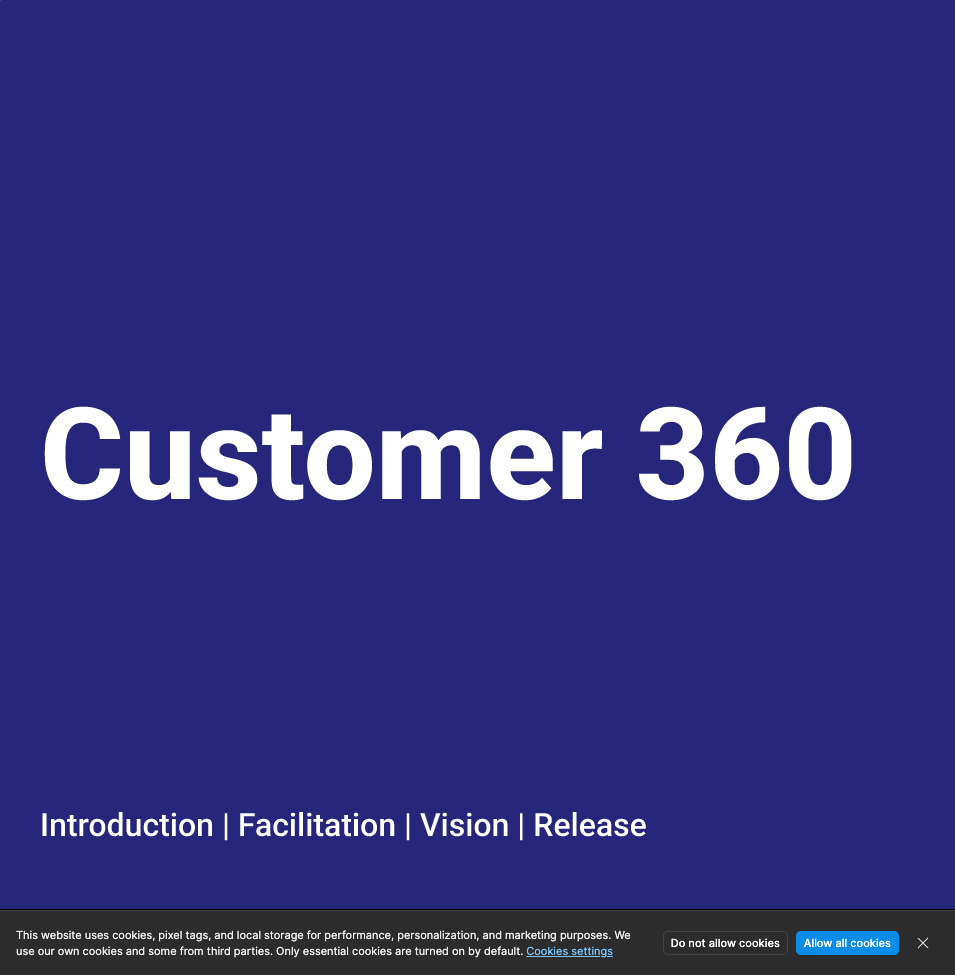

### Slide 2 — Introduction & My Role
ServiceNow CSM Customer Ops is the foundation for industry solutions; there's a need to visualize
customer & related info (products, services, relationships, insights). Customer 360 is part of the
larger **Entity 360** effort (Business Location 360, Account 360, Customer 360, Household 360…).
Data model offerings: Identity; Auxiliary info; Relationships; Products/Services used (Install
Base); Products/Services purchased (Pre-Sales & Order Mgmt); Post-Sales Support (Contracts &
Entitlements). **My role:** brought in to own & lead Customer 360 as the only design partner;
create & validate 360 concepts, ship MVP with engineering, and drive the roadmap via vision.

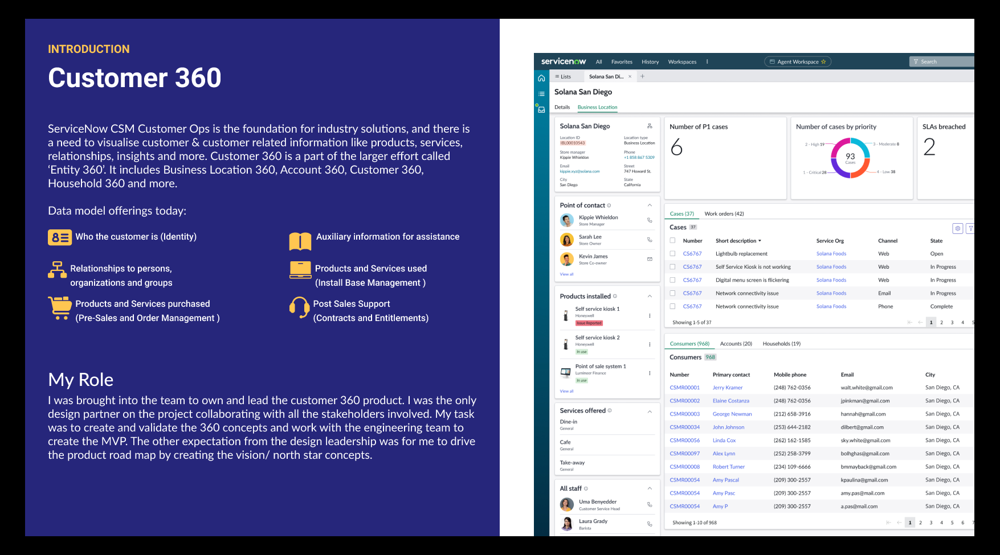

### Slide 3 — Horizontal Approach
Core CSM Platform (Workspace & Portal) → **Customer Ops** layer (Customer 360, Service Org 360,
Order Management, Install Base, Post Sales Support, Process Based Layouts) → **Industry** verticals
built on top: HCLS (Patient 360), PSDS (Constituent 360), FSO (Customer 360), Telco (Customer 360),
Retail (Service Org 360), and more.

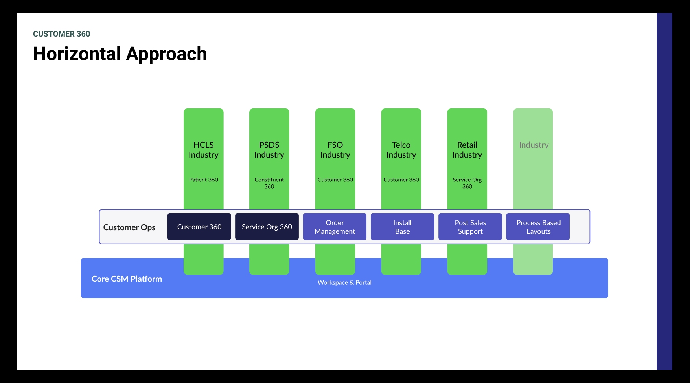

### Slide 4 — Verticals
Financial Services (Account 360, Branch Support); Government (Constituent 360, (Inter)Agency
Support); Healthcare (Patient 360, Hospital Support); Retail & Hospitality (Customer 360, Store
Support); Education (Student 360, Campus Support) — each with its own support agents and settings.

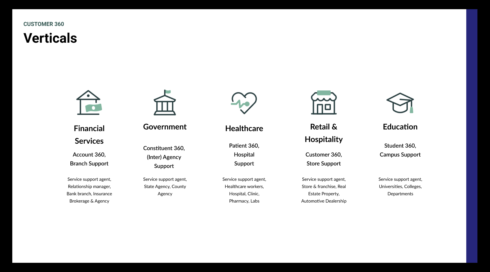

### Slide 5 — Personas
Service Support Agent · Location Support Agent · Middle & Back Office Agent · Relationship Manager.

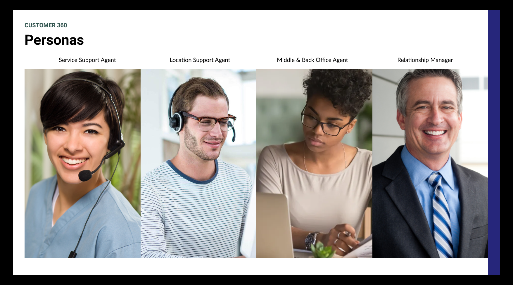

### Slide 6 — How Might We
HMW enable **customer-facing personas** (frontline agents, mid/back-office agents, Relationship
Managers, location staff) to: **1)** access customer information seamlessly as they provide
support; **2)** make informed decisions as they view information reflecting the reality on the
ground; **3)** utilise customer visualisations to initiate workflows (proactive and reactive) —
as they provide the best customer experience throughout the business lifecycle (Purchase,
Onboarding, Usage, Post-Sales).

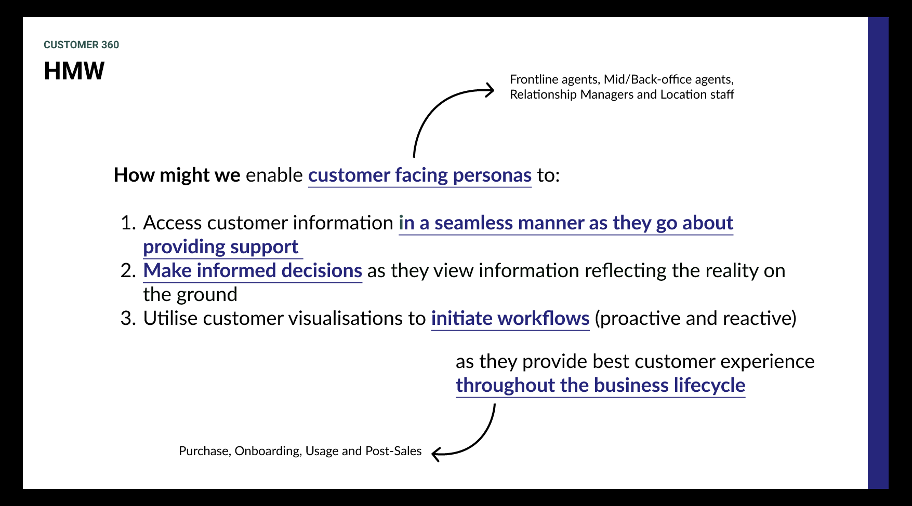

---
### FACILITATION

### Slide 7 — Section divider: Co-Creation Sessions

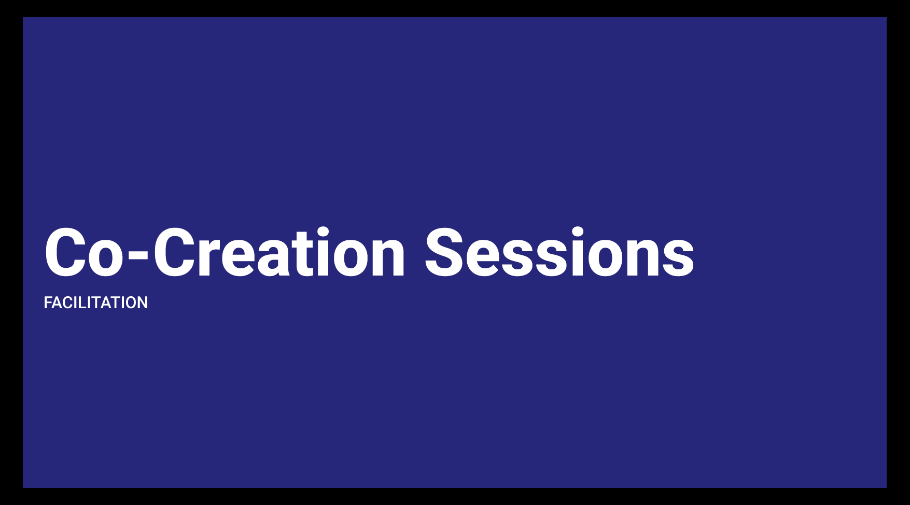

### Slide 8 — Co-Creation
**Objective:** primary goal — validate the initial Customer 360 concepts; secondary goal —
understand patterns across industries to create a horizontal product. **My role:** facilitator for
all workshops/sessions, closely collaborating with industry designers and PMs. **Plan:** two-stage
co-creation, each with multiple sessions — Stage 1 with designers (understand each industry, first
concept validation); Stage 2 with other key stakeholders, PMs, and engineering leads for real
feedback to build a proper horizontal product.

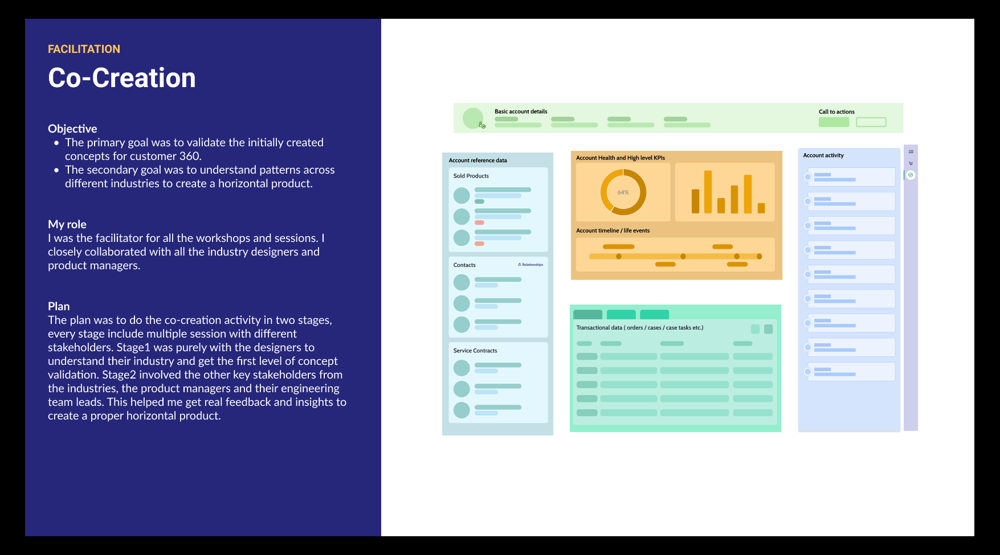

### Slide 9 — Gameplan
**Stage 1:** understand patterns across industries; validate V1 designs; collaborate/co-create with
designers; create V2 industry-specific templates; create awareness; empower designers to adopt.
Steps: Kick-off → Co-create → Deep-dive → Draft Design.
**Stage 2:** validate proposed experiences with customers; incorporate feedback on V2; refine
concept; create delivery-ready designs; feasibility analysis for the template approach.
Steps: PM & SC Validation → Refined Design → Engg Validation → Final Designs.

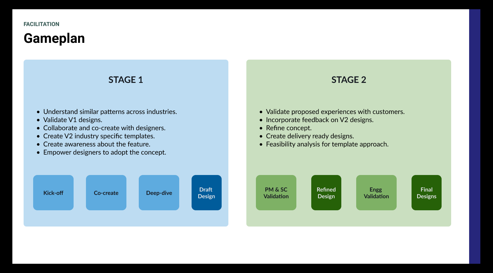

### Slide 10 — During Sessions
**Kick-off:** intro session — build a relationship, discuss objectives, walk through the
co-creation process. **Co-create:** Part 1 — participants talk about their industry, use-cases,
personas; Part 2 — showcase the current 360 concept and discuss; Part 3 — co-create and enrich the
360 experience for the industry. **Deep dive:** detail out the industry template, refine & define
the final industry-specific template, deep dive into special industry widgets.

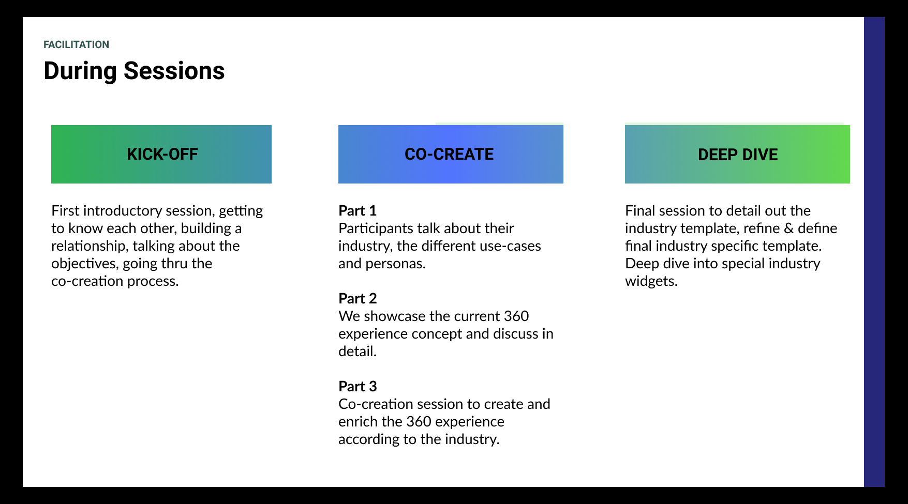

### Slide 11 — Session Learning
**Industry Priorities** — verticals have different focus/priorities; uptake roadmap is complex and
long-term. **Scalability** — different use-cases mean the solution must scale up and down. **Unique
requirements** — industries have unique problems needing unique solutions. **Awareness and
Support** — create awareness that a 360 solution exists and support verticals while they build.

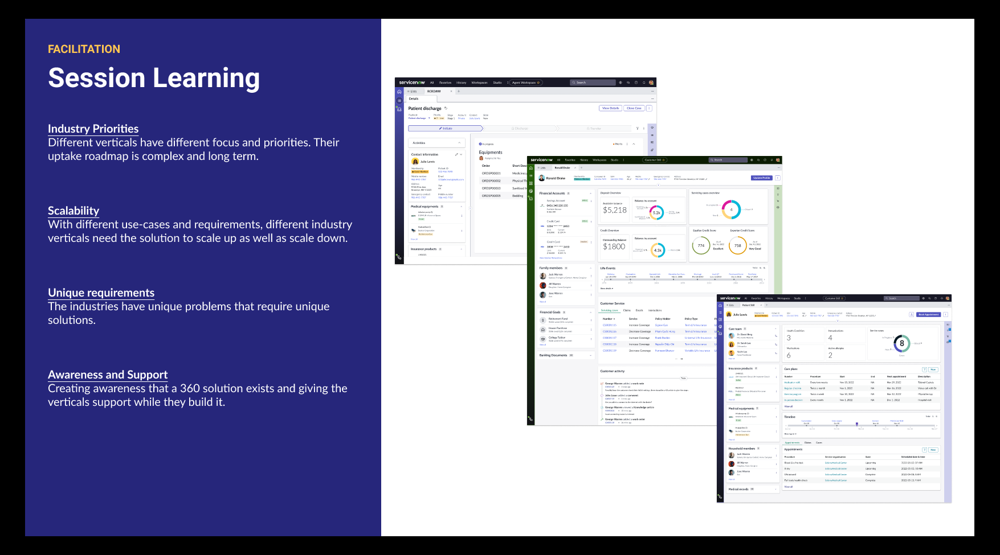

---
### VISION

### Slide 12 — Section divider: Entity 360 (Product Vision)

### Slide 13 — Entity 360 (Vision)
**Objective:** as a product partner, drive the product vision and influence the roadmap; create
plausible vision concepts and validate with multiple stakeholders. **My role:** create high-level
concepts and validate them (individual designer on the project). **Plan:** create an ideal
plausible concept → validate with stakeholders → shape a north-star that can be released within a
few releases; designs had to be scalable and flexible enough to consider patterns across all
industries.

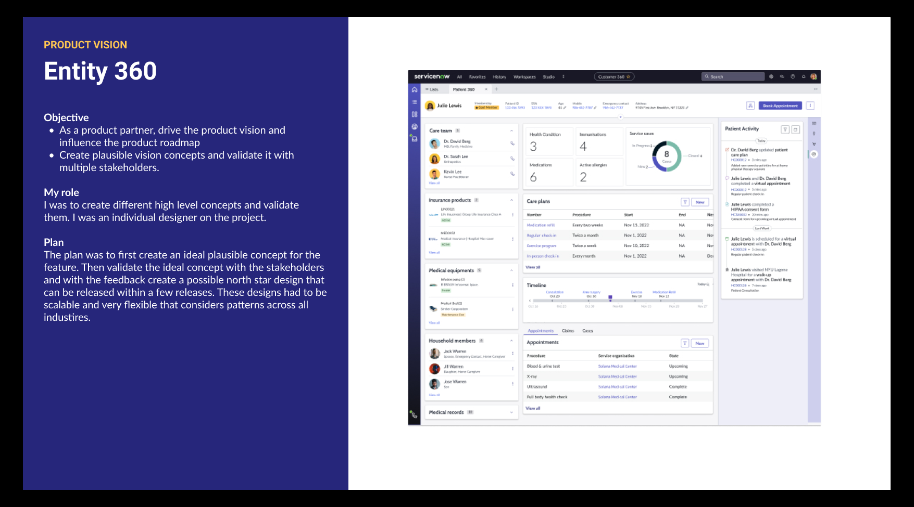

### Slide 14 — Carve-Up (layout anatomy)
The 360 layout carved into reusable regions: Basic account details + Call to actions; Account
reference data (Sold Products, Contacts & Relationships, Service Contracts); Account Health & high-
level KPIs; Account timeline / life events; Transactional data (orders / cases / case tasks);
Account activity; Recommended Actions.

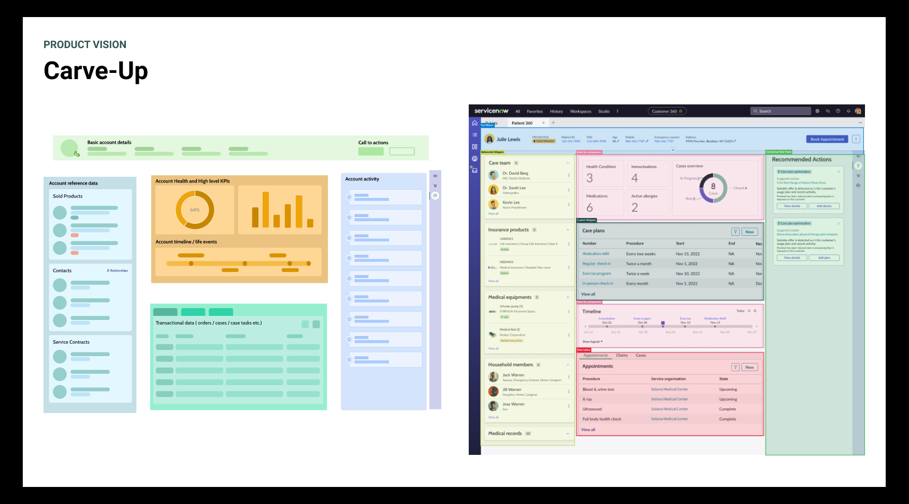

### Slide 15 — Entity 360 (concept gallery)
Concepts across entity types: Account 360, Consumer 360, Household 360, 360 x Playbooks, Install
Base 360, Patient 360, Service Org 360, and a relationship Node Map.

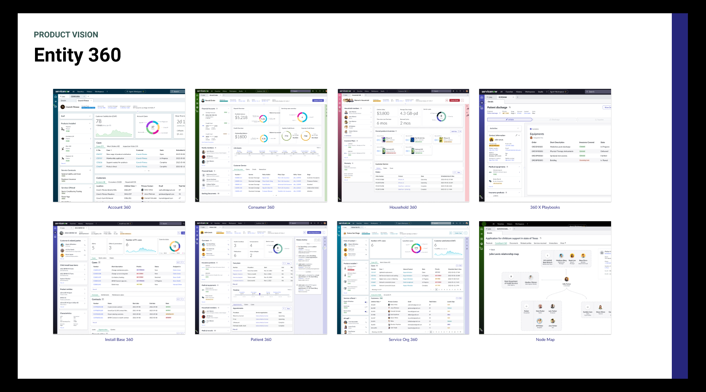

### Slide 16 — Customer Validation
Quotes: *"You are going in the right direction. It meets my expectations quite well."* / *"It will
help customer focus teams and business roles to drive proactive growth conversations."*
**Learnings:** B2B is the most prominent relationship (then B2C, B2B2C); information density varies
significantly across industries (need expandable/collapsible components + in-component search);
account activity is preferred in the right contextual panel (expand/collapse) as second-level
detail; persona-based layouts and re-ordering of components are very useful.

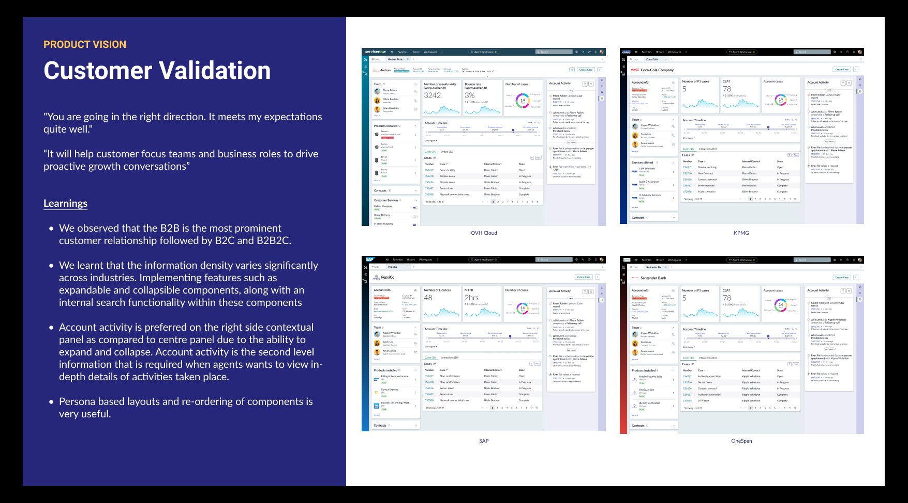

---
### RELEASE

### Slide 17 — Section divider: Business Location 360 (Product Release)

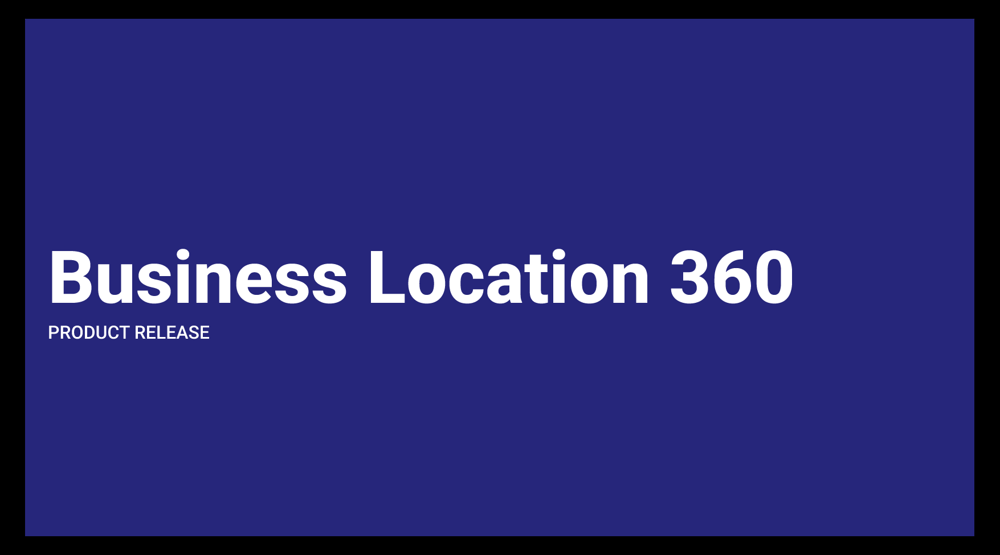

### Slide 18 — Business Location 360 (Release)
**Objective:** release Business Location 360 first; create realistic, release-specific designs;
collaborate closely with the PM and scrum team to ship. **My role:** create high-fidelity designs,
collaborate with PM and engineers; solo designer owning the product. **Limitations:** current
ServiceNow Agent Workspace capabilities; at times an absent PM to drive the release. **Plan:**
create designs buildable with current capabilities; drive the release with the PM; work closely
with engineers on flows → pages → components; play part product manager when needed.

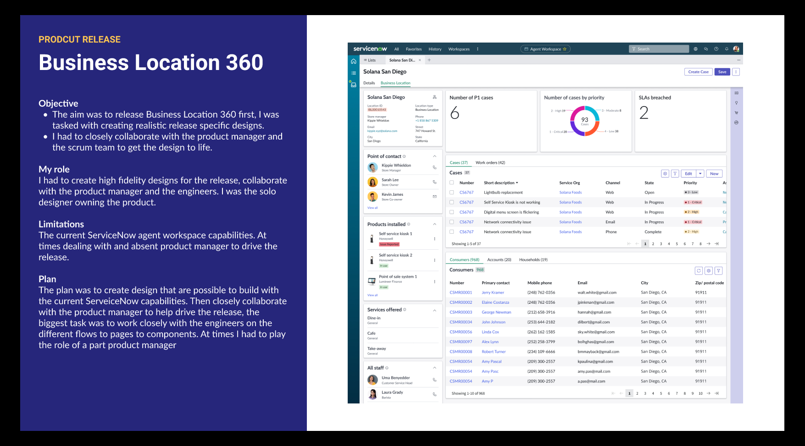

### Slide 19 — Big Picture
**BLSP** (Business Location Service Portal) — the customer side, where store employees / managers
create cases and raise requests. **BL360** (Business Location 360) — the fulfiller side, a detailed
view of the business location that lets the agent resolve requests faster.

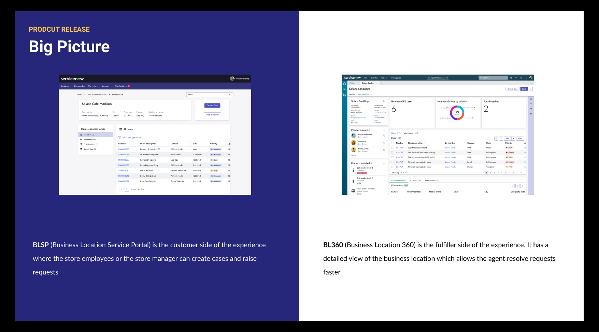

### Slide 20 — Persona
**Central Support Agent** — a fulfiller persona on the central support team who resolves cases for
different business locations. **Need:** ability to View, Inspect, and Act on various facets of a
'Business Location'. **Goal:** assist any business location and its staff by supporting smooth
day-to-day operations and delivering the best customer experience.

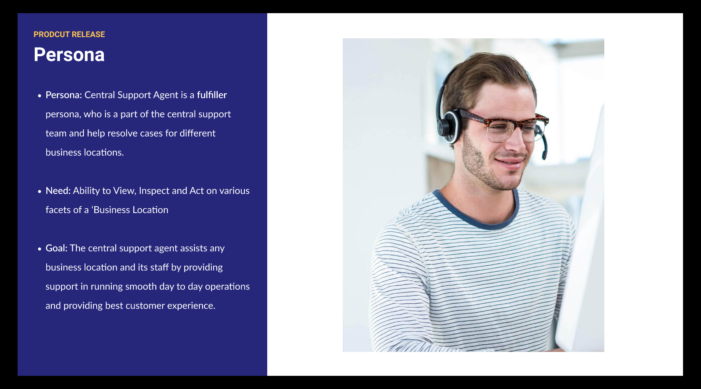

### Slide 21 — Current Experience (the "before")
Customer information is distributed across related tabs (multiple clicks, context switching); no
visual way to understand customer data, relationships, product hierarchy, or customer journey
(critical pieces hidden in simple lists); no seamless, context-aware customer info while working on
a case; case and customer are two separate monolithic entities; and customer types are no longer
just individuals — the experience must scale to complex Service Orgs and Location Accounts.

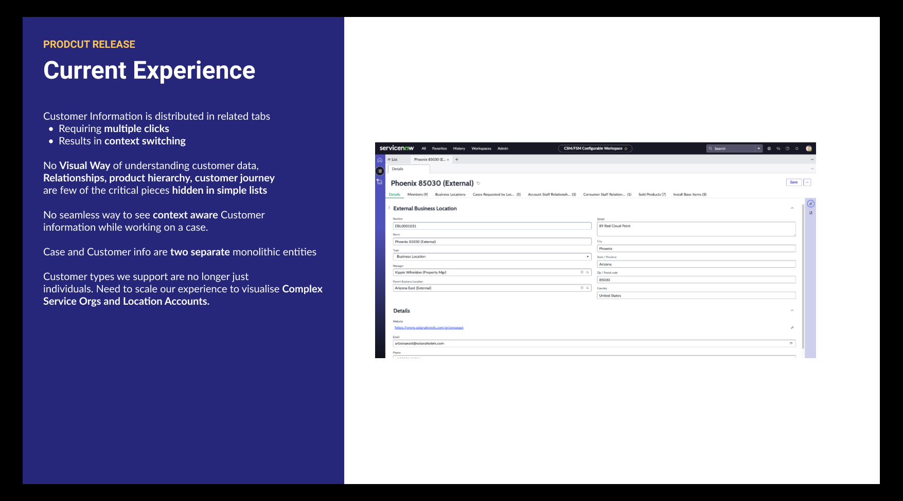

### Slide 22 — Business Location 360 (shipped)
The released designs: the Business Location 360 detail view (Solana San Diego — P1 cases, cases by
priority, SLAs breached, cases list, consumers) and a case view with the 360 context alongside.

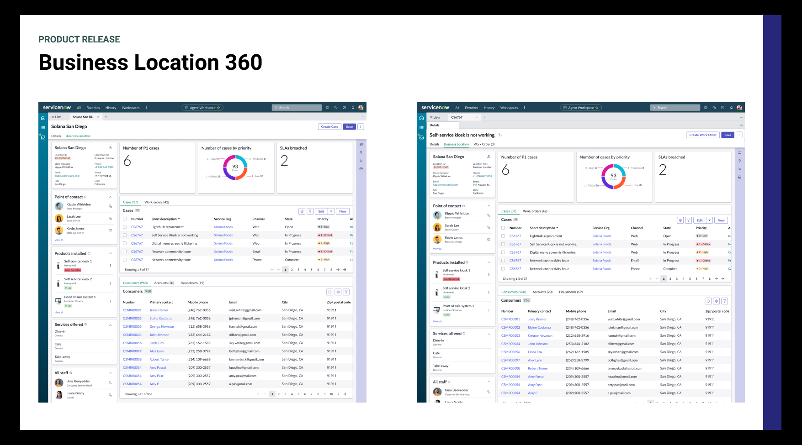

### Slide 23 — Thank You

---

## Images / visuals to re-create

The deck screenshots above are the source of truth. For the public page, the key visuals to
re-create in the site's design language (ink + terracotta + paper) are:
- **The 360 dashboard** (cover) — profile + KPIs + timeline + activity panels.
- **The Horizontal Approach** — Core platform → Customer Ops modules → industry verticals.
- **The Carve-Up anatomy** — the reusable region map of the 360 layout.
- Optionally the **two-stage co-creation gameplan** for the Facilitation section.

(Deck screen-captures can supplement; clean Figma exports would be ideal for a final polish.)

## Confidentiality notes

Per author: **no redaction required** for this ServiceNow / 2022 project — customer names and
screens shown in the deck can be used. (Still keep it tasteful and outcome-focused.)

## Open items

- Confirm exact job title wording for 2022 (deck says owning/lead designer; site experience
  timeline lists ServiceNow as "Product Designer → Senior Product Designer").
- Optional: obtain higher-resolution Figma exports to replace deck screen-captures for final
  polish.
