# Messaging Component Builder 2.0

- **Slug:** `messaging-vision`
- **Page:** `work/messaging-vision.html`
- **Company:** Salesforce — Service Cloud (Digital Engagement)
- **Role:** Lead Product Designer
- **Timeline:** Deck dated Jun 2026
- **Status:** 🔒 **Confidential** — real product. Named customers and exact internal metrics are
  redacted on the public site; full detail saved for a live walkthrough / on request.
- **Leading skill lenses:** **Vision** (AI-led north-star concept) + **Facilitation**
  (workshops, HMW, leadership buy-in) + **Release/Rigor** (heuristic audit, user testing, metrics).
- **Source material:** private Figma deck — "Messaging Component Builder 2.0"
  (26 slides, captured Aug 2, 2026). All slide screenshots preserved in
  `assets/case-studies/messaging-vision/`.

---

## One-liner

A north-star redesign that reimagines Salesforce's Messaging Component Builder as a
**generative-AI workspace** — turning a legacy, error-prone tool (0/8 task success) into a
"Tell me + Tweak it" experience designed to leapfrog competitors.

---

## Context

The Messaging Component Builder is the **unified framework for creating and deploying rich
media components** across Salesforce's messaging ecosystem — it powers **7+ channels**
(Enhanced Chat, WhatsApp, Apple Messenger, SMS, Line, Facebook Messenger, and more) and sits
under high-volume, high-stakes enterprise customer operations.

## Constraint

- The existing tool was a **legacy UI** with outdated interactions and heavy reliance on
  external documentation. Like many legacy tools, it was **built by engineers** — so the UX was
  inconsistent and "all over the place," optimized for the system's structure rather than the
  user's.
- Users hold a **channel-first mental model**, but the backend is **channel-agnostic** — a
  fundamental gap between how users think and how the system works.
- Enterprise stakes: it serves large customers and high monthly volume, so the redesign had to
  preserve power-user capability while becoming approachable for novices.
- Real client work → screens and specifics are confidential.

## Decision

Reframe the builder as a **Generative AI Workspace** built on a **"Tell Me + Tweak It"** model:
the user describes intent in natural language, the AI drafts a preview and asks clarifying
questions, and guardrails (proactive audit, fallback creation, approvals) keep output valid
before activation. A "Breathing UI" minimizes/expands chat and contextual menus to reduce
cognitive load, and the center canvas gives a persistent, real-time preview.

## Trade-off

The **"Tell Me + Tweak It"** balance is the core tension: pure AI generation is fast but opaque;
full manual control is precise but slow and intimidating. The concept deliberately blends
**rapid AI generation with the granular control enterprise users require** — AI gets the user
~80% of the way instantly, then inline tweaking + guardrails handle the last mile.

**The deeper constraint that shaped the concept:** the current system was built by engineers
around a **channel-agnostic backend framework**, and engineering was **not open to changing that
architecture**. But users hold a **channel-specific mental model**. Rather than fight either
side, I designed a concept that **respects both** — and that is precisely why AI became central:
**AI does the translation between the user's needs (channel-specific intent) and the system's
needs (channel-agnostic structure).** The user states their channels and intent in plain
language; the AI silently maps that onto the agnostic backend. This reframed AI from a
"nice-to-have" into the load-bearing bridge that made the whole vision feasible without an
architectural rewrite.

## Outcome

- Concept validated the problem hard: baseline usability testing showed **0/8 task success**
  and an **85% hesitation index**, with **7/10 Nielsen heuristics** rated critical.
- Produced a north-star vision (concept + task flow + wireframes) and stakeholder alignment via
  workshops and How-Might-We reframing.
- Defined next steps: high-fidelity prototypes → second round of user testing → engineering
  feasibility workshops.
- _Note: this is a vision/north-star effort; outcomes are validation + direction + buy-in
  rather than shipped GA metrics._

---

## Process & sequence (important — worth showcasing)

The order of the work matters and should be visible on the page:

1. **Diagnose the *current* product first** — ran the **heuristic evaluation** and **user
   testing** on the existing builder. This produced the hard evidence (7/10 heuristics critical,
   0/8 task success, 85% hesitation) that made the pain undeniable.
2. **Align stakeholders** — ran **workshops** with stakeholders (design, PM, engineering) to
   turn that evidence into shared understanding and reframe it into How-Might-We statements.
3. **Create the vision** — only *after* evidence + alignment did I design the north-star
   **Generative AI Workspace** concept.

Evidence → alignment → vision. The vision is credible *because* it came last, grounded in the
first two phases.

## Future direction

Next, create concepts and **working prototypes for a "mid solution"** — an intermediate step
that sits **between the current product and the full north-star vision**. This gives the team a
shippable, incremental path toward the vision rather than an all-or-nothing leap. (Alongside the
deck's stated next steps: hi-fi prototypes → user testing #2 → engineering feasibility
workshops.)

---

## Skill lenses

- **Facilitation** — cross-functional workshops (PM + Engineering), "Go Broad / Go Narrow"
  ideation, How-Might-We reframing, leadership buy-in; used Gemini + Cursor to rapidly ideate.
- **Vision** — the Generative AI Workspace, "Tell Me + Tweak It" flow, Breathing UI, and the
  "leapfrog competitors" north star.
- **Release / Rigor** — 10-heuristic audit with scorecard, 8 moderated user-testing sessions
  across 6 countries, hard metrics, and a PRD-grade guardrails/definitions taxonomy.

---

## Source material — slide by slide (verbatim context + visuals)

> Preserved exactly so nothing is lost even if public copy is trimmed/redacted. Each image is
> the captured deck slide, to be re-created as a website visual.

### Slide 1 — Title
Messaging Component Builder 2.0 · Salesforce (Service Cloud) · Jun 2026 · Hemant Vurakaranam.

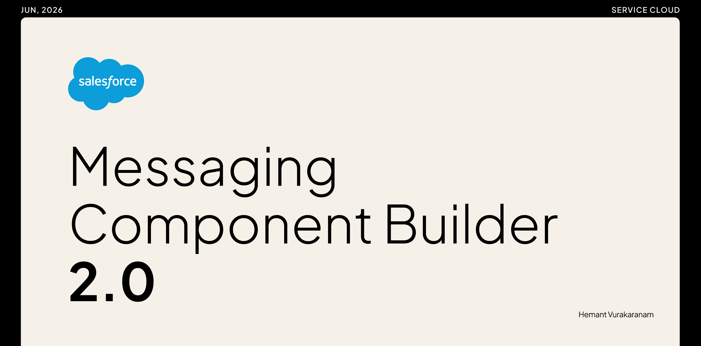

### Slide 2 — What is Messaging Component Builder?
"The Messaging Component Builder serves as the **unified framework for creating and deploying
rich media components** across Salesforce's messaging ecosystem." Visual shows sample rich
components (WhatsApp loan-options card, product carousel, contact card).

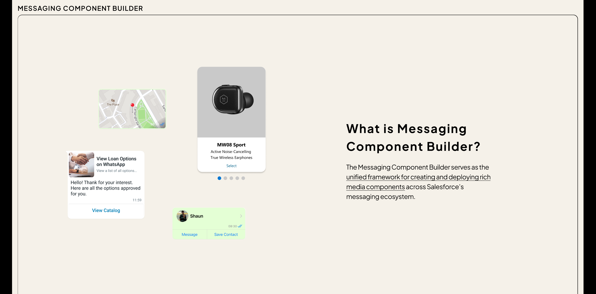

### Slide 3 — Business Impact
- **7+** channels use it (Enhanced Chat, WhatsApp, Apple Messenger, SMS, Line, Facebook Messenger…).
- **800+** monthly active users (avg. unique customers, WhatsApp channel).
- **40M** average order volume — customers include Itaú, Bradesco, América Móvil Perú, Disney. *(confidential)*

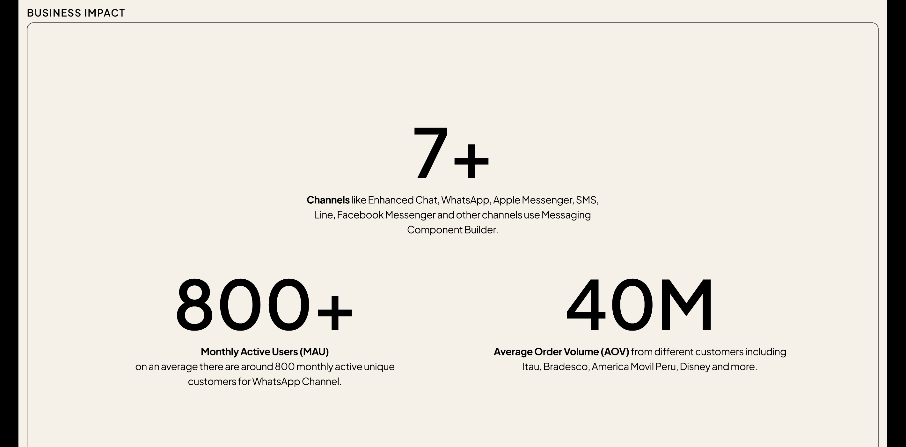

### Slide 4 — Competition
- **Twilio** — Content Template Builder (omnichannel abstraction, built-in fallback logic, channel eligibility badges).
- **Sinch** — Omnimessage Templates & Conversation API ("first-match" auto-rendering, channel-agnostic with overrides).
- **Bird** — Marketing Template Builder (dynamic e-commerce sync, highly visual studio).
- **Gupshup** — Template Bot Builder (no-code bot templates, autonomous AI agents).

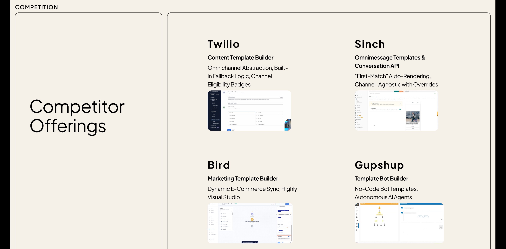

### Slide 5 — Phase 1 divider: UX Audit (The Diagnosis Phase)

### Slide 6 — Methodology: 10 Nielsen's Heuristics Principles
Lists all 10 (Visibility of system status; Match between system and real world; User control and
freedom; Consistency and standards; Error prevention; Recognition rather than recall; Flexibility
and efficiency of use; Aesthetic and minimalist design; Help users recognize/diagnose/recover
from errors; Help and documentation).

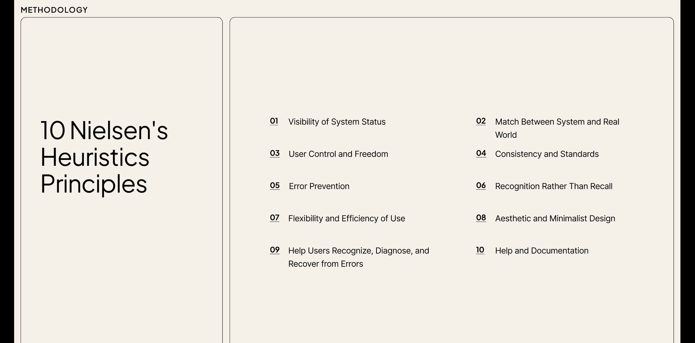

### Slide 7 — 7/10 Critical Heuristics
"7 out of 10 Heuristics principles have multiple UX violations." (7 shown in red.)

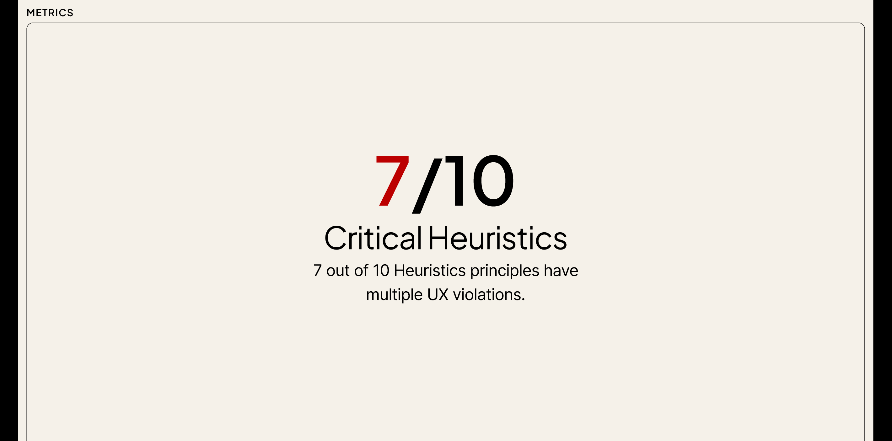

### Slide 8 — Heuristics Scorecard
7/10 Critical, 3/10 Moderate. Per-principle ratings — Critical: Visibility of system status, User
control and freedom, Consistency and standards, Error prevention, Recognition rather than recall,
Flexibility and efficiency, Aesthetic and minimalist design; Moderate: Match between system and
real world, Help users recover from errors, Help and documentation.

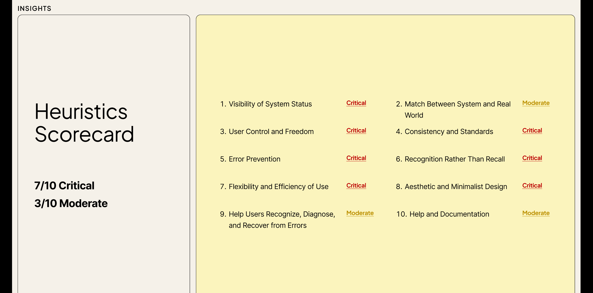

### Slide 9 — Heuristics Callouts (annotated UI)
Annotated screenshot of the live Messaging Component builder screen with lines pointing to
violations: Aesthetic & Minimalist Design, User Control and Freedom, Consistency and Standards,
Help and Documentation, Error Prevention, Match Between System and Real World, Visibility of
System Status, Recognition Rather than Recall, Flexibility and Efficiency of Use.

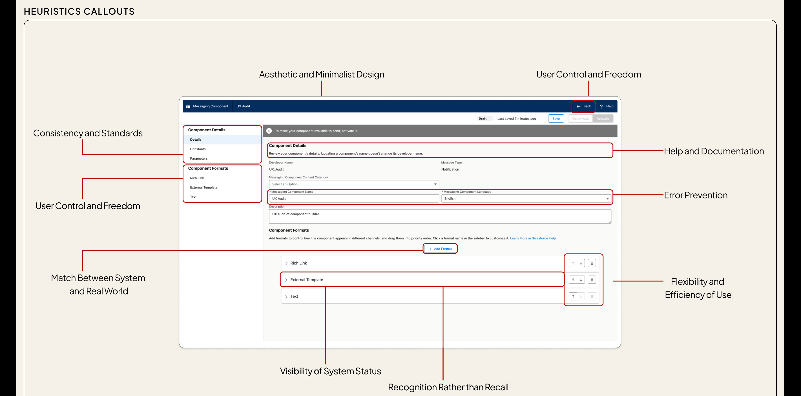

### Slide 10 — 8 User Testing Sessions
- **4** personas interviewed (service admins, product managers, developers with config role, data scientist).
- **8** hours moderated testing (60-min sessions with open feedback).
- **6** countries (United Kingdom, Mexico, India, Finland, Cyprus, USA).
- **3** cloud user types (service, sales, marketing cloud).

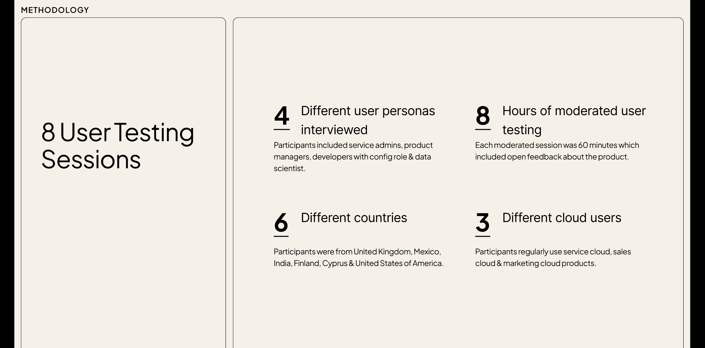

### Slide 11 — Task
"Create a messaging component for a 'Summer Sale Campaign' for your FB Messenger & WhatsApp
customers. The message must include an Image, a header, a body and a URL button."

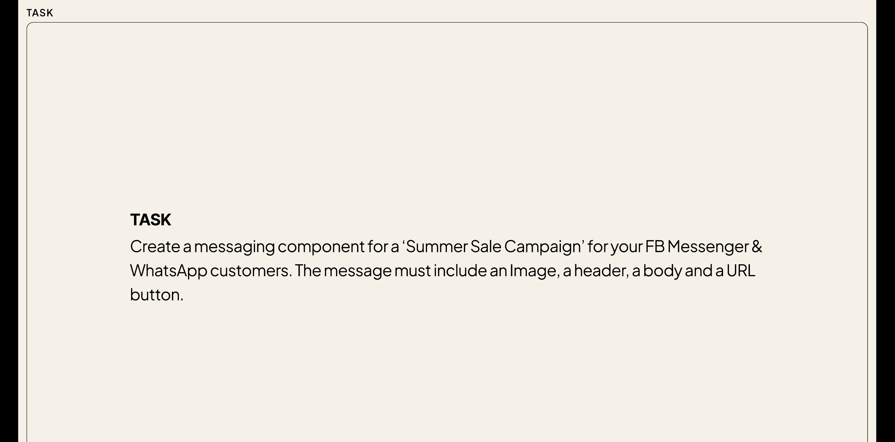

### Slide 12 — Metrics
- **0/8 Success Rate** — 100% of users failed to complete the task without intervention.
- **85% Hesitation Index** — 90% of participants felt frustrated and often resorted to clicking random things.

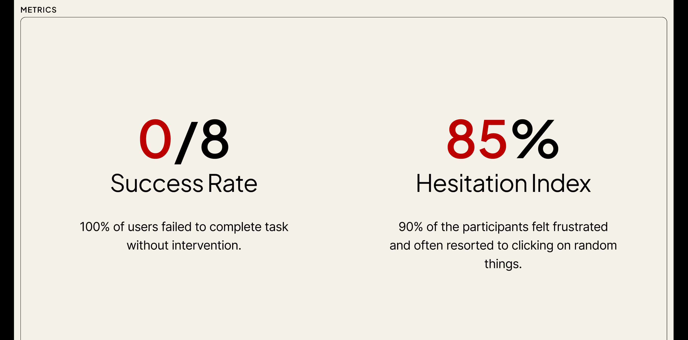

### Slide 13 — User Testing Summary (usertesting.com)
Discoverability issues; Navigation issues (trial & error); Channel-specific mental model;
Inconsistent content (didn't match mental model); High documentation reliance; Legacy UI (outdated, interactions not simple).

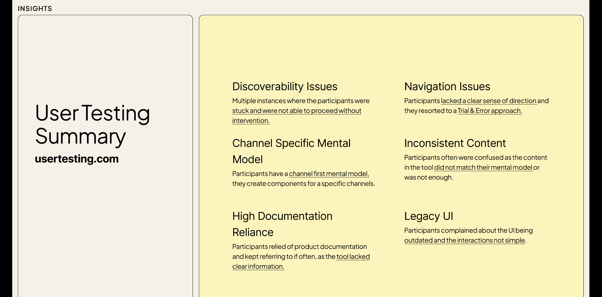

### Slide 14 — Voice of the Users
Quotes: "The tool is **not intuitive**" — Julio · "It's not impossible to work with but is very
**inefficient & frustrating**" — Pavlos · "Let the system handle the **complexity** and not the
user" — Josan · "**I don't think I will buy this product** the market provides better solutions"
— Khushboo · "It's a bit **tricky** man" — Maria.

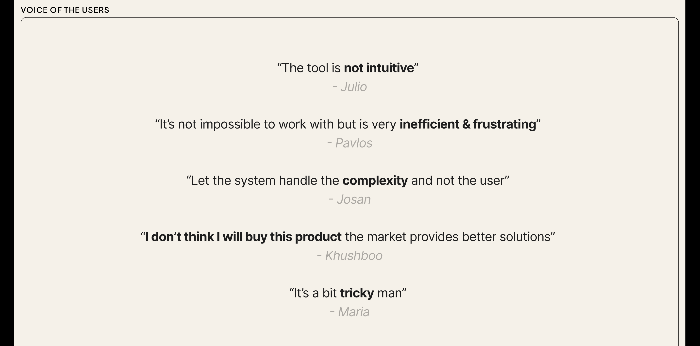

### Slide 15 — Why (pivot)
"This is why we need a **REDESIGN** of the messaging component builder."

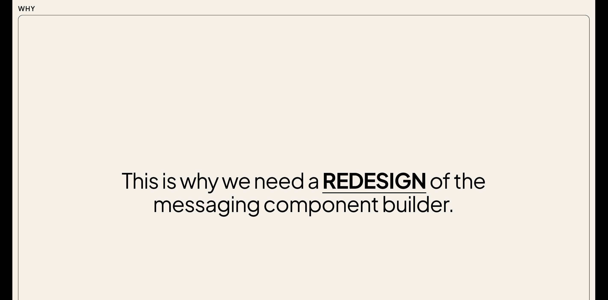

### Slide 16 — Top UX Suggestions
- **Channel Specific** — the user's mental model is channel-specific and the interface should reflect that.
- **Simple System** — let the system handle complexity; keep navigation simple, flexible, predictable.
- **Consumer Grade Experience** — follow current UX best practices; keep the user informed with a clean UI and relevant content.

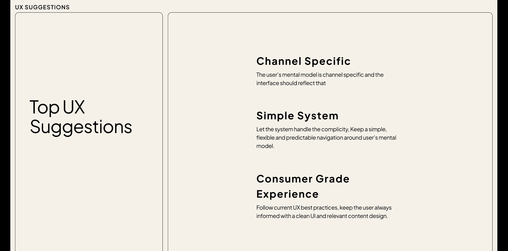

### Slide 17 — Phase 2 divider: UX Workshops (The Alignment Phase)

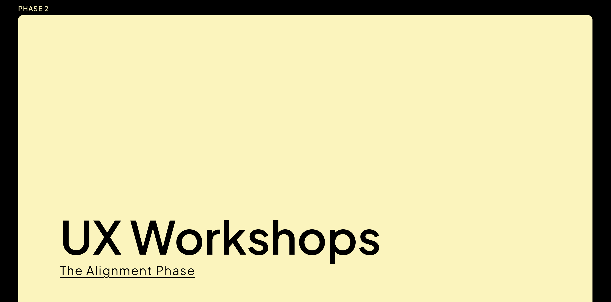

### Slide 18 — Facilitation: Workshops & Audience
- **Collaboration** — not an isolated UX effort; cross-functional participation and shared ownership across the org.
- **Go Broad** — peer workshops to remove barriers to creativity; no idea off-limits.
- **Go Narrow** — sessions with PM & Engineering to reconcile vision with technical feasibility, scope, real-world constraints.
- **Vibe With AI** — leaning into design-dev collaboration using **Gemini and Cursor** to rapidly ideate/vibe on concepts.

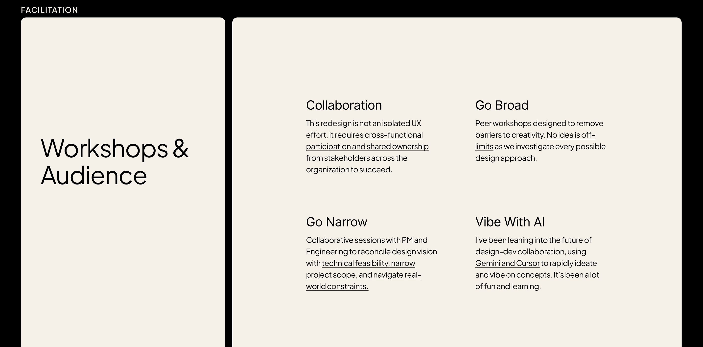

### Slide 19 — How Might We
- HMW **modernize the legacy UI and interactions** to rebuild user trust and perceived product value?
- HMW **bridge the gap** between our channel-agnostic backend and the user's "channel-first" mental model so the system handles the complexity?
- HMW **provide clear, contextual guidance** within the UI to eliminate heavy reliance on external documentation?
- HMW **improve error prevention and system visibility** so users don't resort to random clicking and trial-and-error?
- HMW **create an experience for power users and novice users**?

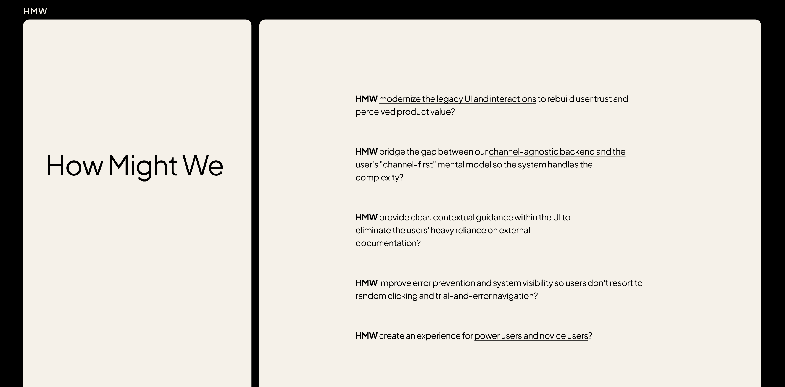

### Slide 20 — Guardrails & Definitions (PRD)
Taxonomy across columns:
- **Context:** One-Way (business-initiated), Auto Response (end-user initiated), In-chat (agent-to-customer).
- **Component Type:** Question with Answers, Catalog, Forms, Time Selector, Payments, Authentications, Other.
- **Formats:** Rich Link, Media, Card Carousel, Quick Replies, List Selector, Web Page, Catalog, Button Selector, Other.
- **Approach:** Presets, Third-Party Templates, Custom Component.
- **Message Elements:** Header, Sub-header, Thumbnail, Body, Footer, Button, Other properties.
- **Assets & Data:** Constants, Parameters, Apex Class, Product ID, Other unique data.

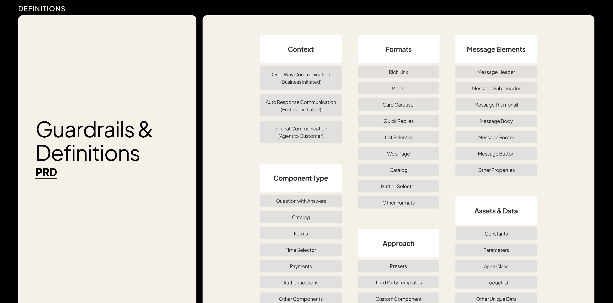

### Slide 21 — Concept: Generative AI Workspace
- **100% Success** — starting with a natural-language prompt + contextual chips gets the user ~80% of the way instantly.
- **Low Cognitive Load** — AI acts as an interactive, inline guide (e.g. "Apple doesn't support this layout, want me to generate a text list instead?").
- **Agnostic & Specific** — user states channels upfront; center canvas gives a persistent real-time preview; system silently handles translation to the agnostic backend.
- **Database-Oriented Data** — merging static and dynamic data directly into message elements to align with human logic.

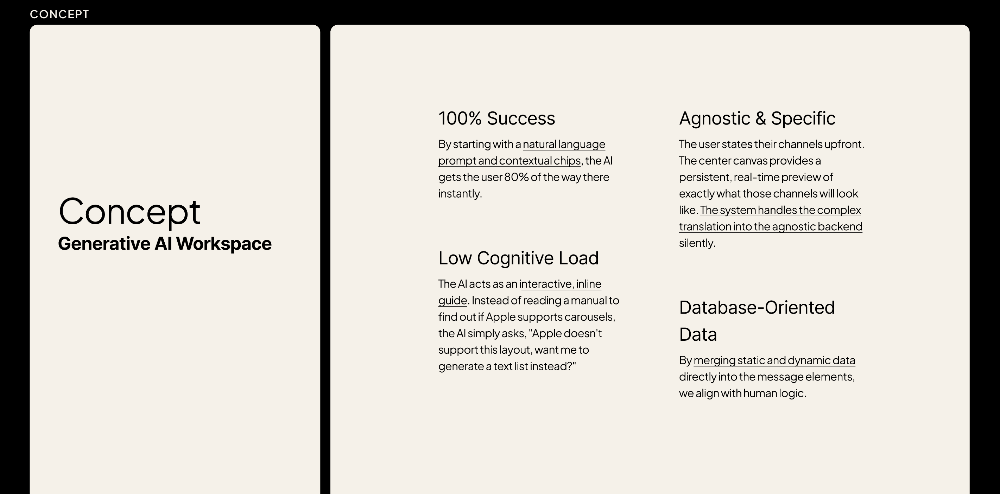

### Slide 22 — Task Flow: "Tell Me + Tweak It"
Flow: User logs in → types prompts → (AI-first approach: AI understands intent, drafts preview,
asks clarifying questions) → (consumer-grade experience: user clicks preview, tweaks component)
→ (guardrails: proactive AI audit, fallback creation, user/third-party approval) → Activation.
"The 'Tell me + Tweak it' model perfectly balances the rapid speed of AI generation with the
granular control enterprise users require."

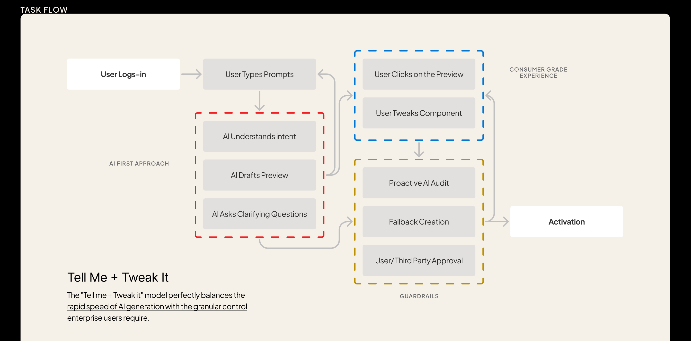

### Slide 23 — Concept wireframes
- **Component Definition** — conversational interface ensures complete, accurate component definition via intuitive prompts and proactive AI counter-questions.
- **Breathing UI** — automatically minimizes & expands the chat and contextual menus to reduce cognitive load.
Both wireframes show: left AI Chat panel, center Component + Preview with "80% Complete", right rail of Assets / Data Needs / UI Configuration / Data Configuration.

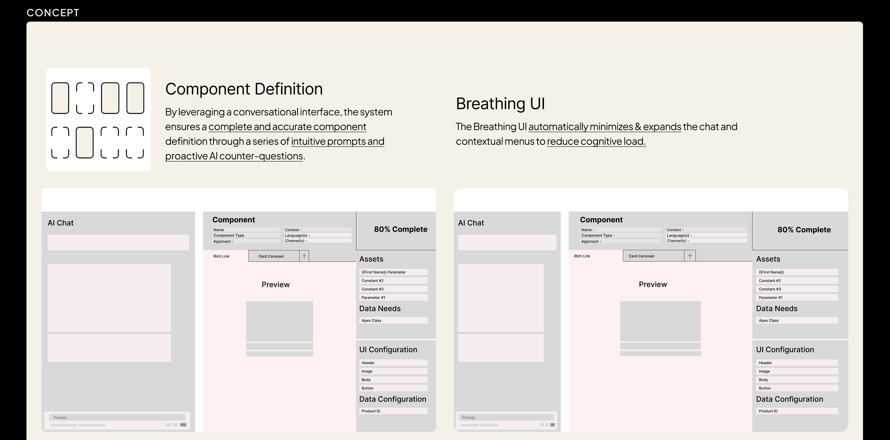

### Slide 24 — Why (payoff)
"If we execute this forward looking concept, **we won't just be catching up to our competitors,
we will be leapfrogging them**."

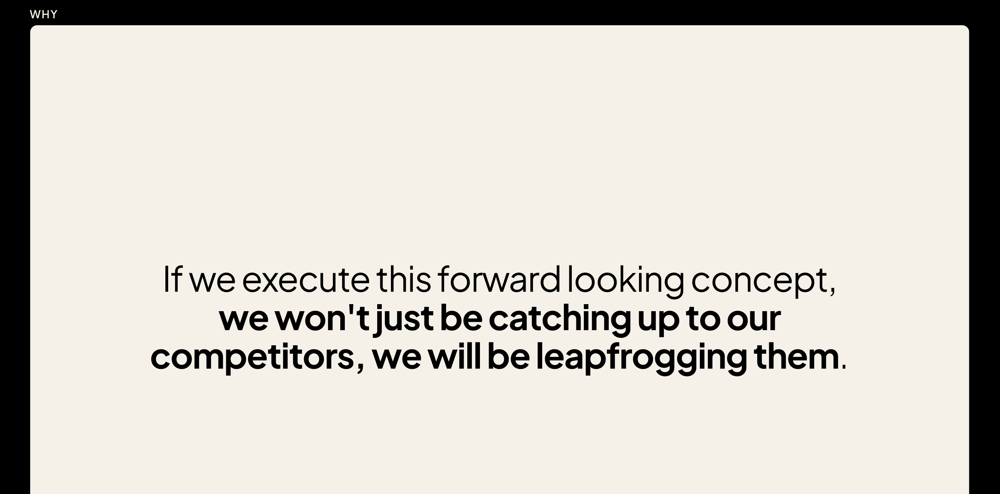

### Slide 25 — Next Steps
- **High Fidelity Prototypes** — E2E prototype with primary use-cases; happy path first, then error/edge cases.
- **User Testing #2** — another moderated round on the prototypes for unfiltered feedback.
- **Engineering Workshops** — after UX & PM leadership buy-in, align with Engineering on critical aspects & feasibility.

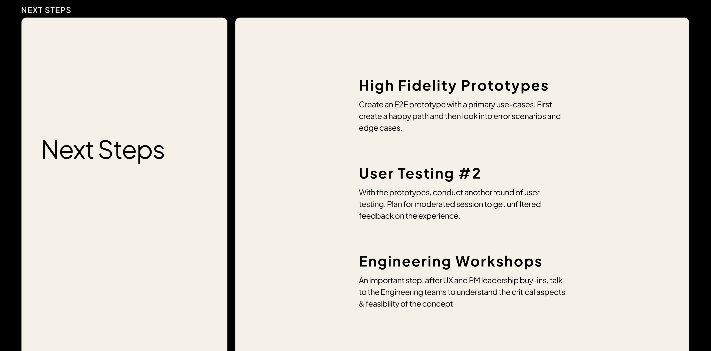

### Slide 26 — Thank You

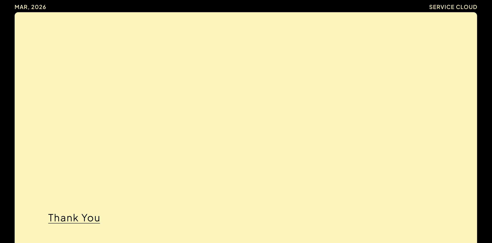

---

## Confidentiality notes

- **Public-safe:** the narrative arc (audit → testing → workshops → AI vision), methodology
  (Nielsen heuristics, moderated testing), the "Tell Me + Tweak It" concept, and the general
  problem framing.
- **Redact / hold for interview:** named customers (Disney, Itaú, Bradesco, América Móvil Perú),
  exact internal metrics (40M AOV, 800+ MAU, channel counts if considered sensitive), and any
  un-redacted product screenshots (slide 9 shows the real UI — blur/redact before publishing).
- On the public page, present metrics like 0/8 success and 85% hesitation as *study findings*
  (safe) but gate the *product's* business metrics behind "deep dive on request".

## Open items

- Decide which visuals are safe to publish vs. must be redacted/blurred (esp. slide 9 real UI).
- Obtain higher-resolution exports (these are screen captures of the deck); replace with clean
  PNG/SVG exports from Figma before building final site visuals.
- Confirm whether any hi-fi prototype visuals exist yet to add to the "Vision" section.
