# Patient360

- **Slug:** `patient360`
- **Page:** `work/patient360.html`
- **Company / framing:** **Self-initiated** (portfolio framing). _Source material was originally a
  timed design challenge; see "Reframing" below — the goal is to present this as a self-directed
  exploration, not an interview deck._
- **Role:** Product Designer (solo — end-to-end)
- **Title (final):** "Patient 360: one system, two clinicians."
- **Timeline:** **2023**
- **Status:** 🌐 **Public** — self-initiated / fictional scenario; safe to show in full.
- **Leading skill lenses:** **Release/Rigor** (discovery, personas, journey, needs matrix) and
  **Vision** (a single role-adaptive system). Facilitation is light here (solo project).
- **Source material:**
  1. Figma Slides deck "Challenge" — 13 slides (the *thinking* / discovery: scope → personas →
     journey → needs matrix → HMWs → learnings). Screenshots in `assets/case-studies/patient360/`.
  2. Figma prototype "Challenge" (the *solution* / final hi-fi UI — **received Aug 2, 2026**).
     15 key screens captured in `assets/case-studies/patient360/final/` and documented in
     "Final design screens" below.

> **Status update — we now have the solution.** The deck stops at Key Learnings, but the **final
> hi-fi prototype has been shared and walked through**. It shows a working end-to-end story across
> **both personas** (nurse + doctor) on one shared record — vitals capture, the nurse→doctor
> handoff, an AI summary, a focus-mode consultation with smart Rx, a compliance reference panel,
> and the loop back to the nurse. This makes Patient360 a genuine **end-to-end** case study
> (discovery → definition → designed solution). See "Final design screens" for the full inventory
> and my recommendation on which few to feature.

---

## One-liner

A patient-records concept for a medical SaaS: one system that **adapts to whoever logs in** —
doctor or nurse — so each sees the right information and tools for their part of the same patient
consultation.

---

## The core idea (from you)

**Two users, one system.** The solution serves two personas — **Doctor** and **Nurse** — and the
system seamlessly reshapes itself for the different use cases **depending on the logged-in
persona** (persona-based layouts + re-ordered components over a shared core of patient data).

---

## Context

A fictional fast-growing medical-software (SaaS) company wants the best all-in-one platform to
help medical practitioners get on top of their processes — bookings, reminders, patient
registration, records, clinical notes, claims and billing. The brief: create a solution that helps
practitioners **make better decisions by accessing and capturing vital clinical information**
(history, examination notes, procedures, prescriptions, lab reports).

**Requirements given:**
- Find a specific patient by ~20 criteria (name, surname, patient number, address, DOB, gender,
  email, date of last visit, etc.).
- See an overview of the patient's medical history + all clinical information.
- Take notes during consultations with full access to patient info.
- Work across desktop **and** mobile.

## Constraint

- **Scoped deliberately.** Of three possible scenarios (Consulting, Admitted-Patient, Emergency
  Room), the work focuses on the **doctor–patient consultation with a returning patient**, because
  it encompasses the core use cases.
- **Little primary research** available — concept built on secondary research + conversations with
  contacts in healthcare, captured as explicit assumptions.
- **High-stakes, compliance-heavy domain** — data protection, consent, and clinical compliance
  matter (see the "Healthcare system" slide + Reframing note about how to handle its Austria/EU
  specificity).

## Decision

Design **one role-adaptive system** rather than two separate products. Anchor it in:
- **Personas by Jobs-to-be-Done** (Doctor vs Nurse) rather than rigid personas, since roles overlap.
- A shared **consultation journey** (Pre / During / Post) split across the two roles.
- A **Needs Matrix** that maps each User Need → the Data Need → the Functional Need, so every UI
  component is traceable to a real need.

## Trade-off

_(Light in the deck — worth developing.)_ The central tension is **one adaptive system vs. two
tailored tools**: a single shared core keeps data consistent and cheaper to build, but must flex
enough (persona layouts, re-ordering, device modes) to fit two very different workflows. Desktop
is the primary surface (connected to central systems); mobile is a companion for on-the-go tasks
and summaries.

## Outcome

The exploration goes **all the way to a designed solution** — a role-adaptive Patient360 for
"CARE Hospitals" that proves the "two users, one system" idea in working UI:
- A scoped, defensible problem (the consultation journey) → a shared patient record both roles use.
- **Role-adaptive layouts:** the *nurse* view leads with "Notes for doctor" + a Check-Vitals flow;
  the *doctor* view reshapes the same record to lead with an **AI Summary** + the nurse's notes and
  a **Start / End Consultation** focus mode.
- A **seamless handoff:** vitals and notes the nurse captures surface automatically in the doctor's
  view; the completed consultation flows back to the nurse to action next steps.
- **Reduced data entry** in practice: smart medication autocomplete, structured Rx tables, and a
  compliance/reference panel that surfaces the right clinical literature in context.
- Grounded in the earlier rigor: two role-based JTBD personas, a shared journey map, a Needs
  Matrix, HMWs, and three key learnings that the final UI visibly answers.

**Key learnings (the punchline):**
1. **High cognitive load** — practitioners multitask; the UI must be clear/simple and show relevant
   info in context.
2. **Role-based solution** — roles differ but the core info is the same; persona-based layouts +
   re-ordering tailor the experience to each user. _(This is the "two users, one system" idea.)_
3. **Reduce data entry** — connect systems and organize data into clear sections to avoid repeated
   manual entry.

---

## Skill lenses

- **Release / Rigor** — structured discovery: scope decision, assumptions, JTBD personas, journey
  map, and a needs → data → function matrix.
- **Vision** — the role-adaptive single-system concept (persona-driven layouts).
- **Facilitation** — minimal (solo project); could be framed as stakeholder-empathy / secondary
  research synthesis.

---

## Reframing: interview deck → self-initiated project (recommendations)

The source was a timed challenge for a European company. To present it as **self-initiated**, my
recommended edits (nothing invented — just reframing):

1. **Language.** Replace challenge/assignment wording with self-directed framing:
   - "for this assignment" → "for this exploration / for this project"
   - "the design challenge / the brief" → "a problem I wanted to explore"
   - Drop the "Design Challenge / DYNATRACE" title slide; use a portfolio title instead
     (e.g. "Patient360 — one system, two clinicians").
2. **Company name.** The scenario already uses a fictional company; keep a neutral fictional
   framing (e.g. "a medical SaaS platform") and **do not name the real interviewing company**.
3. **The "Healthcare system / Austrian Healthcare" slide (slide 7).** _My recommendation:_ **keep
   the insight, drop the interview-specific geography.** The underlying points — universal
   coverage, strict data protection (informed consent, data minimisation, right to access,
   breach reporting), and clinical codes of compliance — are excellent, credible design
   constraints. Reframe it as **"Designing for a compliance-heavy, privacy-first healthcare
   context"** and generalize the Austria/EU-specific names (ELGA, Ärztegesetz, etc.) into
   plain-English constraints (or keep GDPR since it's widely understood). This removes the
   "I researched Austria because the company is Austrian" signal while keeping the rigor.
   - ✅ **DECIDED (author):** keep the insight, generalize the Austria/EU specifics.
4. **Assumptions honesty.** The "little research due to time constraints" line reads as
   interview-speak. Reframe as a deliberate, honest self-initiated choice: "As a self-directed
   concept I grounded it in secondary research + conversations with healthcare contacts, stated as
   explicit assumptions."
5. **Europe-specific hints elsewhere.** Needs Matrix lists "Europe compliance" and languages
   (Italian/German/Spanish); soften "Europe compliance" → "regional compliance," keep multilingual
   as a general requirement.

---

## Source material — slide by slide (verbatim content + presenter notes)

> Deck sections (from the table of contents): **Scope · Discovery · Business · Design · Next
> Steps** — but the captured deck ends after the Business/Discovery thinking (Key Learnings).

### Slide 1 — Title
"DYNATRACE — Design Challenge — Hemant Vurakaranam." _(Interview framing — to be replaced.)_

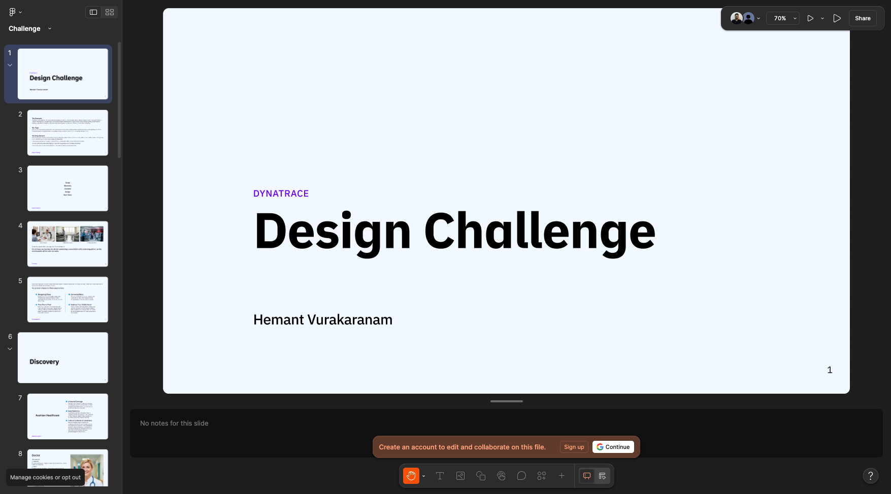

### Slide 2 — Scenario / Task / Requirement
**Scenario:** joined as a Product Experience Designer at "Notill Co.", a fast-growing medical SaaS;
goal is the best all-in-one platform for medical practitioners (bookings, reminders, registration,
records, clinical notes, claims, billing). **Task:** help create a solution that supports better
decisions by accessing/capturing vital clinical info (history, notes, procedures, prescriptions,
lab reports). **Requirement:** find a patient by ~20 data points; overview of medical history +
all clinical info; take notes during consultations; work on desktop + mobile.
_Notes:_ "I am a product designer at a SaaS company called Notill Co… the task is to create a
solution that supports medical practitioners in accessing and capturing key clinical information…"

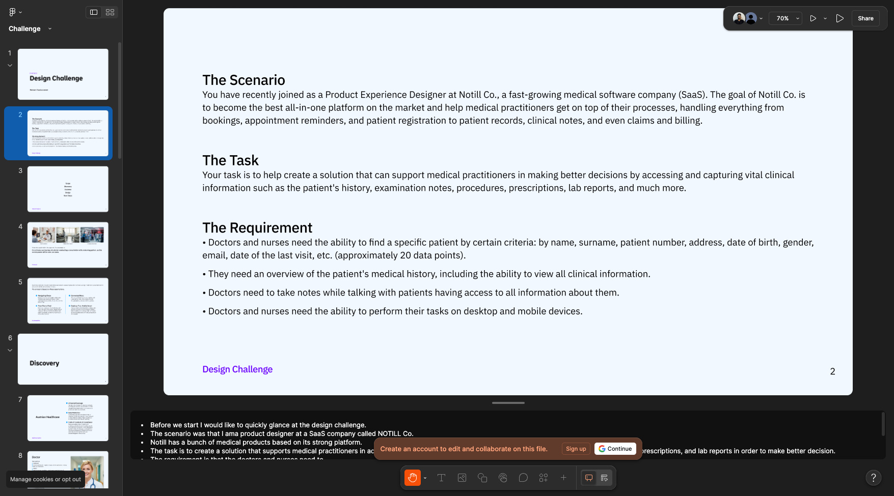

### Slide 3 — Table of Contents
Scope · Discovery · Business · Design · Next Steps.

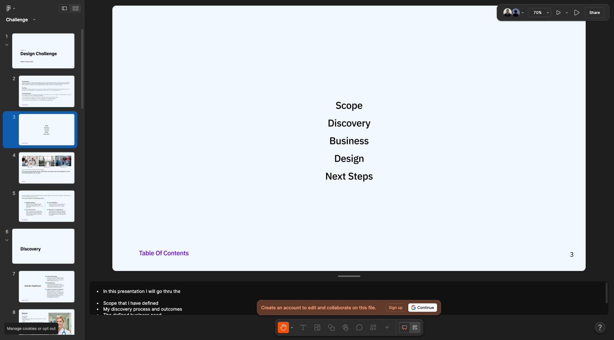

### Slide 4 — The Scope
Three scenarios shown (Consulting, Admitted Patient, Emergency Room). "To keep the scope limited
for this assignment, I've concentrated on **the primary user journey of a doctor conducting a
consultation with a returning patient, as this encompasses all the core use cases.**"
_Notes:_ "There are multiple scenarios… but to keep the scope limited I wanted to focus on the
Patient & Doctor Consultation."

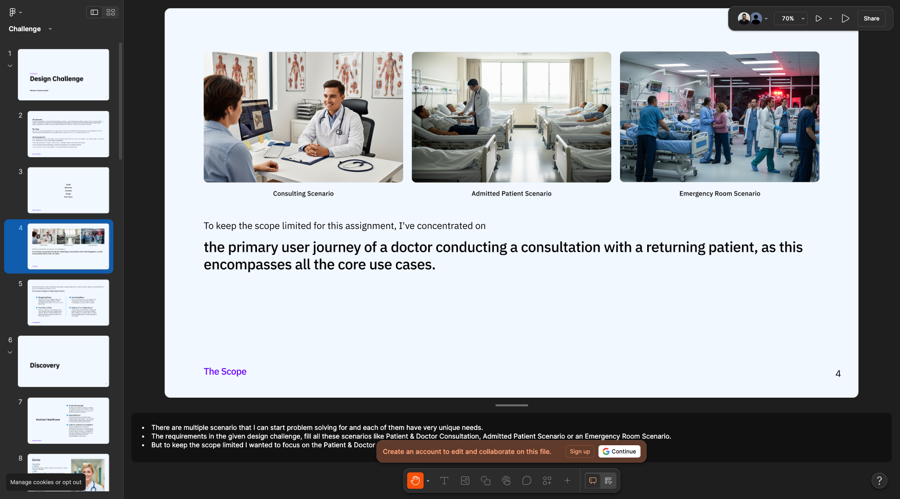

### Slide 5 — My Assumptions
"Due to time constraints, I couldn't conduct direct user research. However, I spoke to a few
friends working in healthcare… and did some secondary research. My concept is based on these
assumptions."
- **Navigating Chaos** — doctors/nurses multitask; frequent context switching; nurses do a lot of
  the heavy lifting.
- **Connected Roles** — nurse and doctor work closely, clear roles, staying connected via digital
  systems and real-time updates.
- **From Pen to Pixel** — mix of tech-savvy and traditional users; many doctors still prefer pen &
  paper; must cater to both ends.
- **Desktop First, Mobile Smart** — core use cases on desktop (connected to central systems);
  mobile ideal for quick on-the-go access + a companion app for updates/summaries.

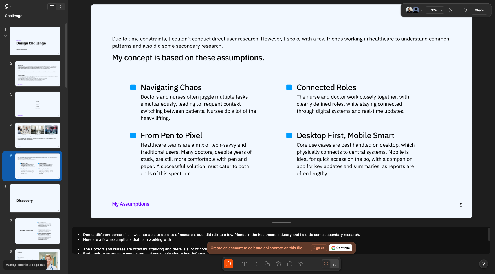

### Slide 6 — Discovery (section divider)

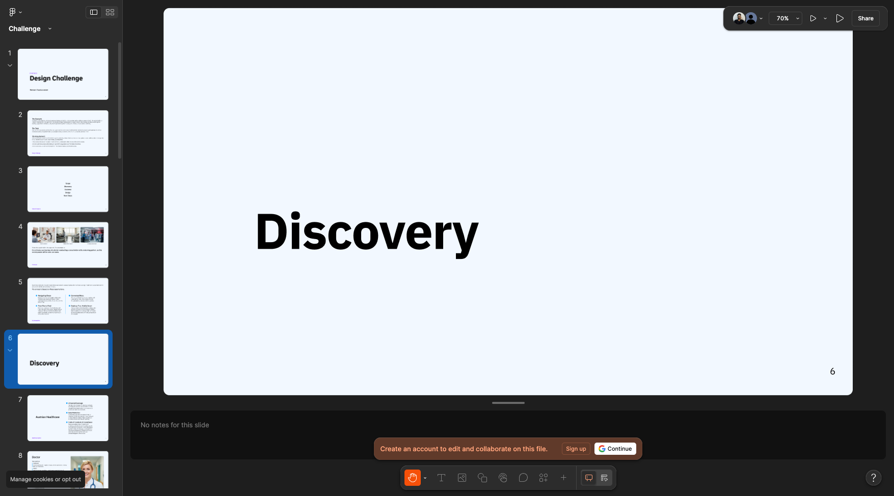

### Slide 7 — Healthcare System (labelled "Austrian Healthcare")
- **Universal Coverage** — mandatory for all residents (employees, self-employed, students,
  pensioners); funded via income-based contributions + a mix of private/public insurance.
- **Data Protection** — follows the EU GDPR; key principles: informed consent, data minimisation,
  right to access & correction, security & breach reporting.
- **Code of Conducts & Compliance** — many codes for doctors/hospitals: ELGA (Elektronische
  Gesundheitsakte), Austrian Medical Act (Ärztegesetz), Hospital Law (Krankenanstaltengesetz),
  Professional Conduct Codes (Berufsordnung), Medicines Law (AMG) & more.
_Notes:_ "I wanted to understand the European, specifically Austrian Healthcare System… universal
coverage… strict data protection (GDPR)… many codes of compliance."
**➜ See Reframing #3 — recommend keeping the insight but generalizing the Austria/EU specifics.**

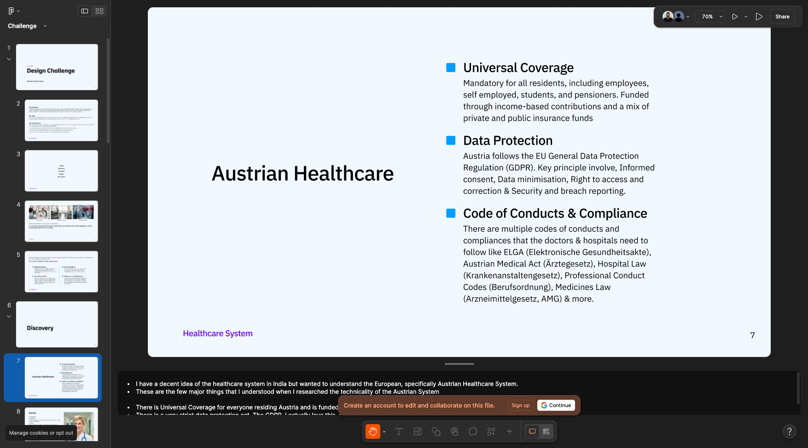

### Slide 8 — Persona: Doctor (Jobs to be Done)
**JTBD:** Understand (patient issues, past records, history & procedures) · Capture (examine, review
reports/history, document findings) · Diagnosis (synthesise facts, explain treatment plan) ·
Treatment (prescribe meds/next steps, put plan in action).
**Pain points:** Information Overload · Fragmented Patient Information · The Burden of Documentation.
_Notes:_ "I've started moving away from personas in general as the roles are sometimes very grey;
I'll talk about the Jobs to be Done and the key pain points."

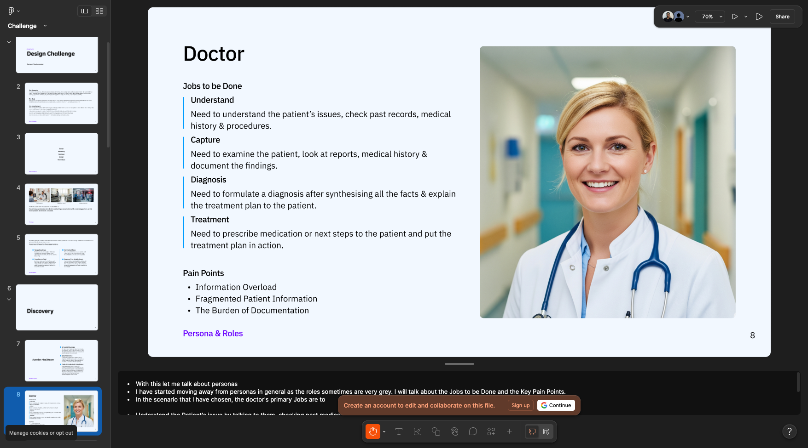

### Slide 9 — Persona: Nurse (Jobs to be Done)
**JTBD:** Prepare (verify identity, document reason for visit, add to doctor's queue) · Vitals
(capture vitals efficiently & accurately) · Coordinate (execute doctor's orders like injection/
dressing, keep record updated) · Facilitate (review doctor's instructions with patient, support
next steps).
**Pain points:** Task Juggling · Constant Interruptions · Communication Delays.

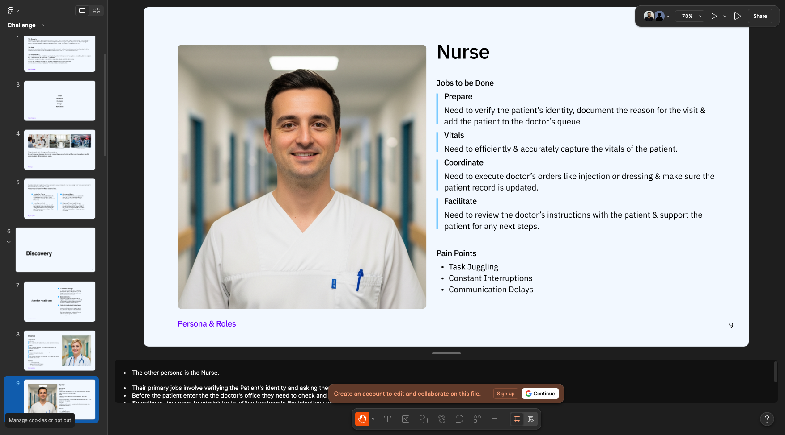

### Slide 10 — Consultation Journey (DIAGRAM — keep)
Swimlane journey across **Pre-consultation / During consultation / Post-consultation**, split into
**Nurse** and **Doctor** lanes:
- **Nurse — Pre:** patient check-in (verifies patient, asks reason for visit, inputs patient
  detail) + preliminary assessment (asks for symptoms, checks vitals, adds patient to queue).
  **During:** administers an in-office treatment. **Post:** patient check-out (ensures record
  updated, patient understands next steps, guides on next steps).
- **Doctor — During:** patient conversation (understands the issue, looks at past medical records,
  looks at diagnostic reports) + diagnosis & treatment (takes notes, physically examines, explains
  the issue, takes a decision, asks the nurse to administer treatment, explains next steps,
  prescribes medications).
_Notes:_ "A patient arrives and is greeted by the nurse… (read from the slide)."

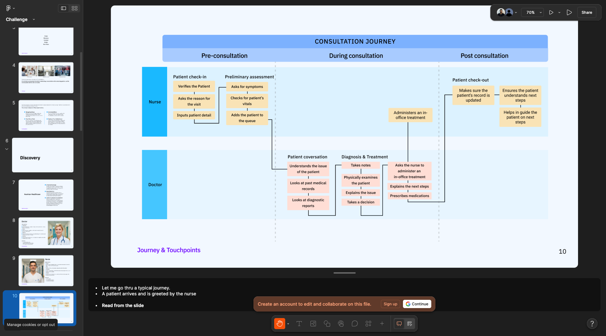

### Slide 11 — Needs Matrix (DIAGRAM — keep)
Maps **User Need → Data Need → Functional Need** for 8 needs:
1. Nurse finds & verifies patient → Name/Surname, Mobile, DOB, Age, Gender, Insurance No., Email,
   +13 more → search, filter, sort.
2. Nurse checks/documents vitals → BP, Temperature, Height, Heart Rate, SPO2, Weight → checklist,
   submit record.
3. Doctor views history & records → allergies, investigation reports, prescribed meds, past
   records, clinical info, family history → full-screen view, keyword search.
4. Doctor takes notes while diagnosing → documenting chief complaint, patient answers → notes
   widget, keyboard & freehand.
5. Doctor documents diagnosis & treatment plan → suggested investigations, instructions, prescribed
   meds, their diagnosis → notes widget, keyboard & freehand.
6. Nurse/Doctor need devices synced in realtime → data entry sync, fallback sync → auto sync,
   manual sync.
7. Doctors refer to new/updated compliant literature → international code/policy, medical reference,
   Europe compliance → reference widget.
8. Nurse/Doctor switch languages → English, Italian, German, Spanish → language change option.
_(See Reframing #5: soften "Europe compliance" → "regional compliance.")_

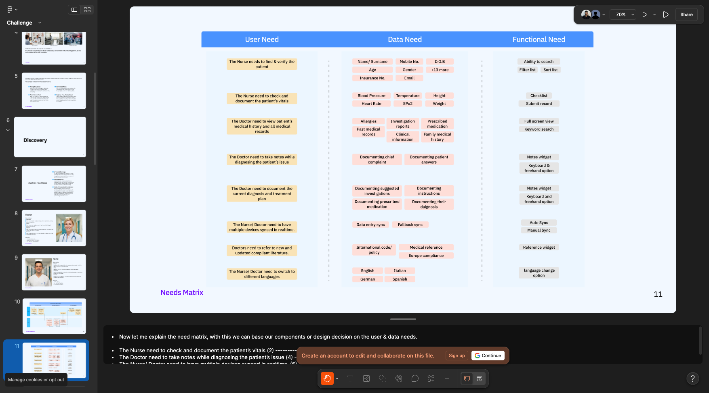

### Slide 12 — HMWs
**Central:** "How Might We enable the doctors and nurses to make better decisions by efficiently
accessing and capturing patient information." Supporting:
- HMW turn a patient's fragmented medical history into a clear, scannable story a doctor can grasp.
- HMW make documenting a consultation feel as natural as the conversation itself, without losing
  the context of the patient's history.
- HMW help a nurse capture a patient's vitals and update core information in the fastest, most
  error-proof way.
- HMW empower doctors and nurses with the right patient information at the right time.

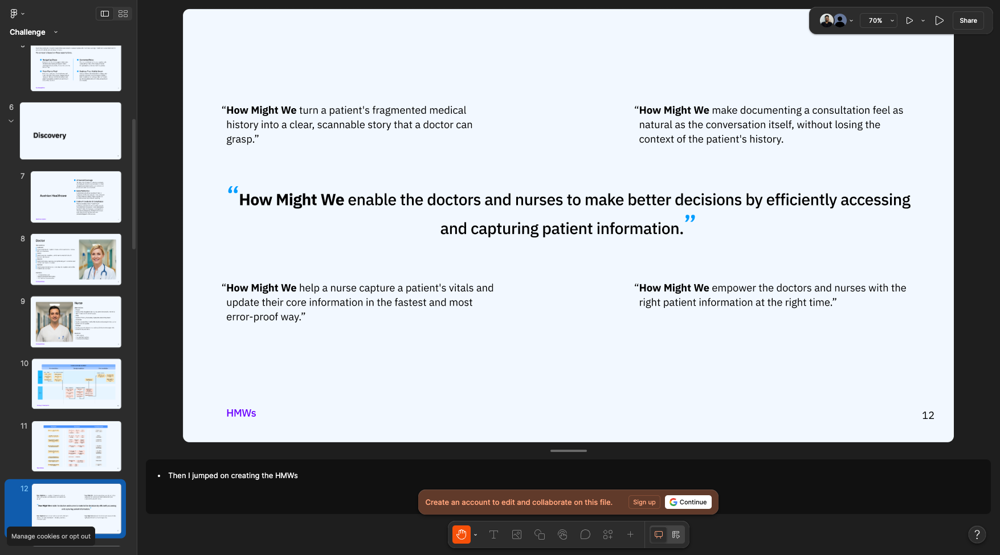

### Slide 13 — Key Learnings (end of deck)
- **High Cognitive Load** — practitioners multitask; keep the interface clear/simple, show relevant
  info in context.
- **Role based solution** — roles/tasks vary but core info stays the same; persona-based layouts +
  reordering tailor the experience. _(= two users, one system.)_
- **Reduce data entry** — connect systems, organize data into clear sections for easier input.

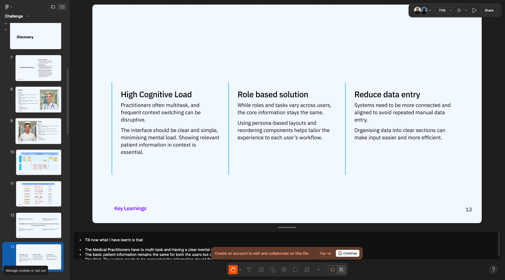

---

## Final design screens — the solution (hi-fi prototype)

> Product name in the mocks: **"CARE Hospitals · Patient360"**, sample patient **Anna Lewis**.
> This is the payoff of the discovery: **one shared record that reshapes itself per logged-in
> role**, with a real nurse→doctor→nurse loop. 15 screens captured in
> `assets/case-studies/patient360/final/`.
>
> ⚠️ **Reframe note:** the sample data uses an **Austria/Linz address** and Austrian codes (**ELGA,
> e-Befunde, e-Medikation, e-Impfpass**) on the compliance panel. If we feature these screens,
> either (a) recapture with a neutral address + generic compliance labels, or (b) keep as-is and
> lean on "designed for a compliance-heavy, privacy-first context." Recommend (a) for the two hero
> screens at least. (Consistent with Reframing #3 / #5.)

### The story the prototype tells (in order)
1. **Nurse opens the patient** — dashboard leads with "Notes for doctor" + empty vitals.
2. **Nurse captures vitals** — Check-Vitals modal (temp, BP, HR, resp, SpO2, glucose, height, weight).
3. **Record fills in** — vitals + notes now populated; Care Plans visible.
4. **Patient Activity feed** — right rail timeline of events (incl. a GDPR consent event).
5. **Doctor logs in** — same record **reshapes**: left rail now shows an **AI Summary** + Nurse
   Notes; primary action becomes **Start Consultation**.
6. **Handoff visible** — the nurse's notes surface under "Nurse Notes" in the doctor's view.
7. **Relationships** — Family Members / household modal.
8. **Deep clinical view** — full-screen Investigation Report (knee X-ray + findings/impressions).
9. **Consultation focus mode** — "End Consultation"; layout collapses to Chief Complaint /
   Doctor's Advice / Rx / Investigations for fast documentation.
10. **In-context compliance** — Healthcare Compliance reference panel (regulatory updates).
11. **Smart Rx** — medication autocomplete while prescribing.
12. **Loop closes** — back in the nurse view (multi-patient queue), the completed session from the
    doctor is a read-only summary the nurse can Send/print for next steps.

### Screen inventory (with recommendation)

Legend: ⭐ = recommend featuring on the page · ➕ = nice supporting screen · ⬜ = keep in md only.

#### ⭐ 05 — Doctor view: role-adaptive layout + AI Summary
The single most important screen: proves "two users, one system." Same patient record, but the
doctor gets an **AI Summary** ("Anna Lewis leads a busy lifestyle… knee surgery… 2 medications… 3
active care plans") and Nurse Notes, with **Start Consultation**.

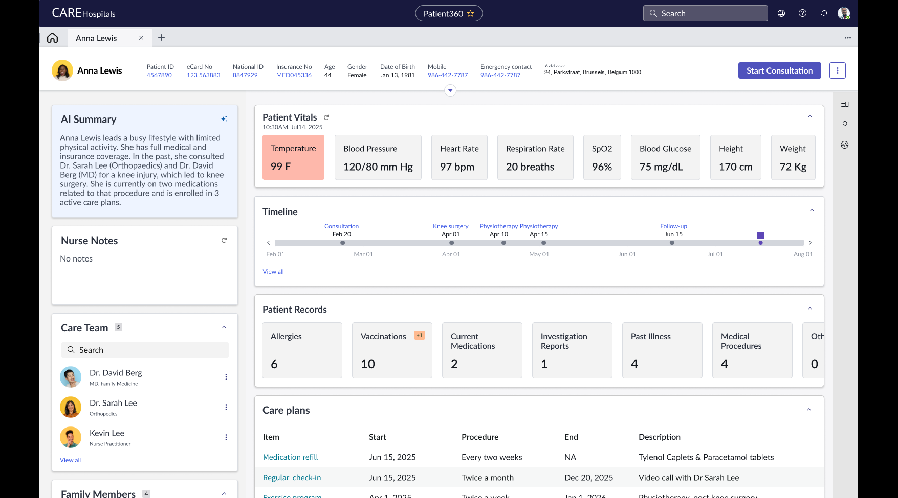

#### ⭐ 03 — Nurse view: the same record, nurse-first
Pair this with #05 as a **before/after of the same patient** to make the role-adaptivity obvious.
Nurse-first layout: "Notes for doctor" up top, vitals filled, Care Plans.

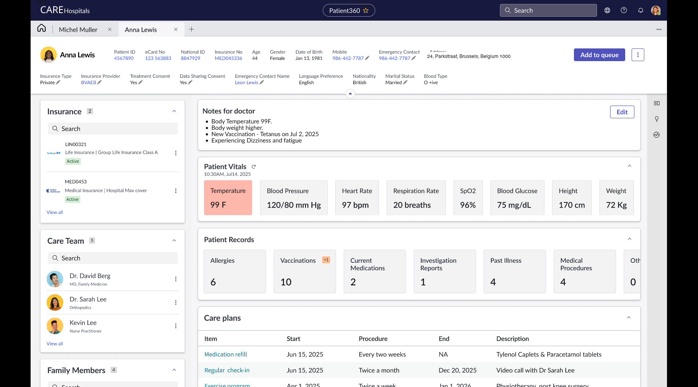

#### ⭐ 09 — Consultation focus mode
Layout reshapes for the *task*: everything collapses so the doctor documents Chief Complaint /
Advice / Rx / Investigations without leaving the patient's context.

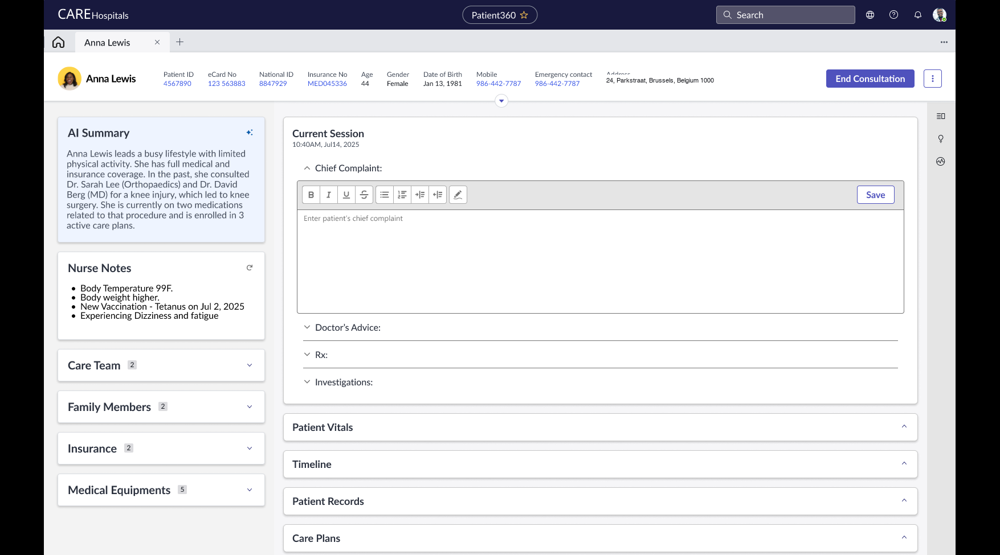

#### ⭐ 11 — Smart Rx (reduce data entry)
Directly answers Key Learning #3. Medication autocomplete while prescribing.

#### ➕ 02 — Check Vitals modal (nurse task)
Shows the nurse's core JTBD (fast, error-proof vitals capture).

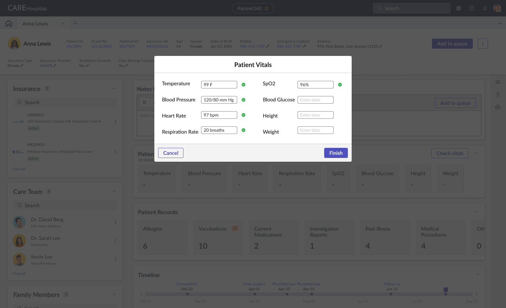

#### ➕ 08 — Investigation Report (full-screen clinical view)
Answers "turn fragmented history into a scannable story" — a clean, full clinical report + X-ray.

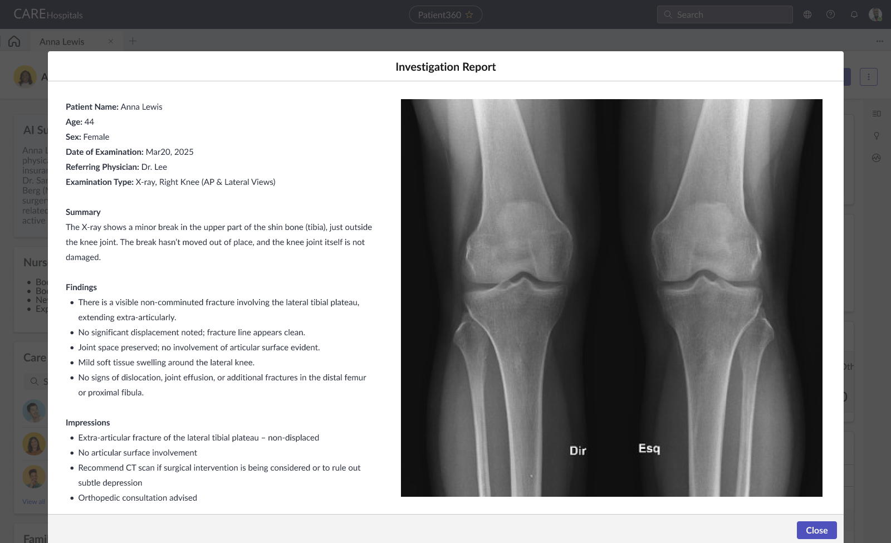

#### ➕ 12 — Loop closes: completed session back to the nurse
The nurse (multi-patient queue) sees the doctor's completed consultation as a send/printable
summary — this is what makes it feel like *one* system, not two tools.

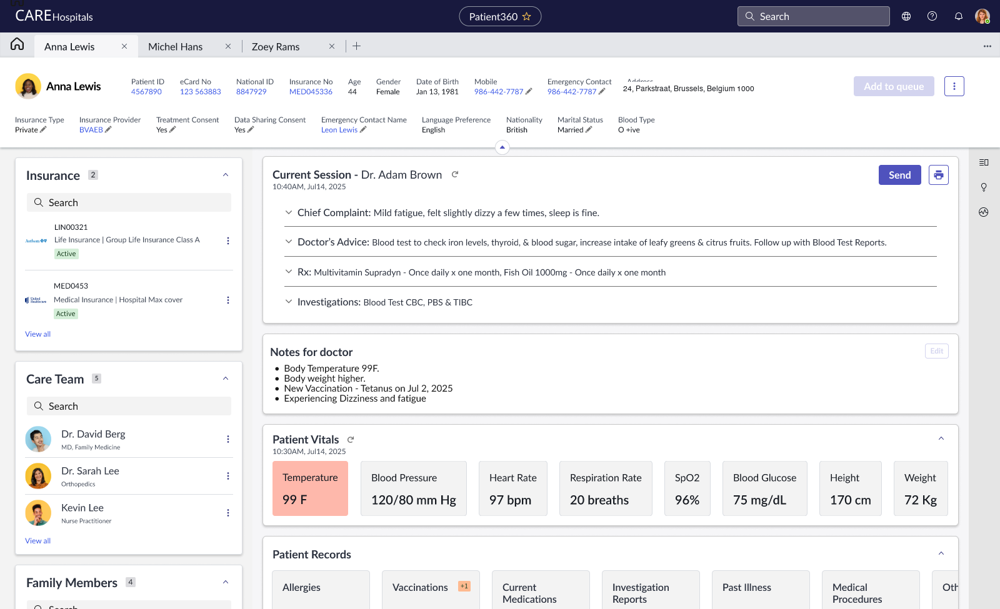

#### ➕ 10 — Healthcare Compliance panel (needs "reframe": generalize labels)
The "reference widget" from the Needs Matrix. Great concept; **generalize ELGA-specific labels** if
featured.

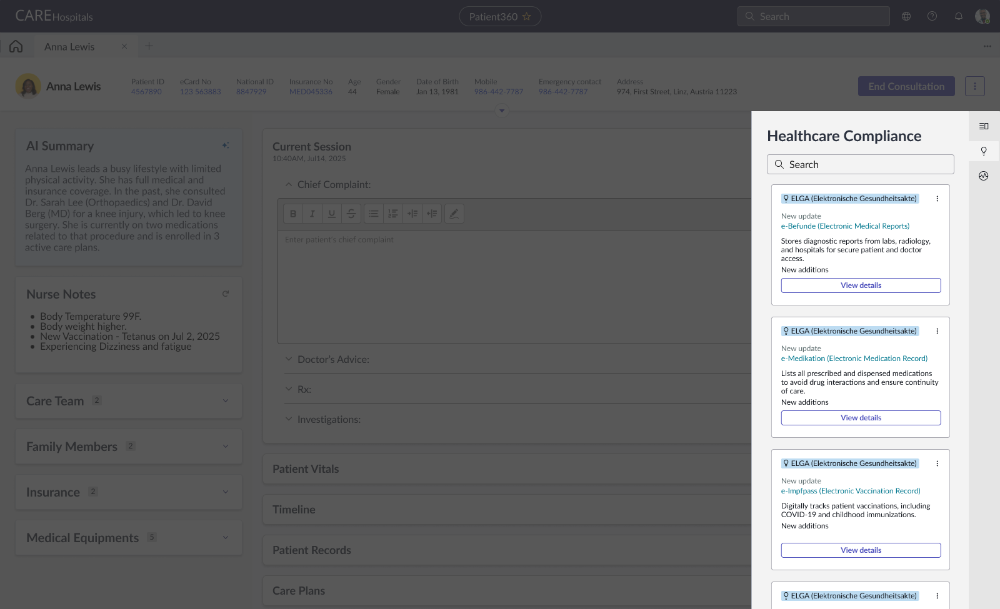

#### ⬜ Supporting (keep in md; use only if space allows)
- **01 — Nurse dashboard, empty state** (start of the story).
  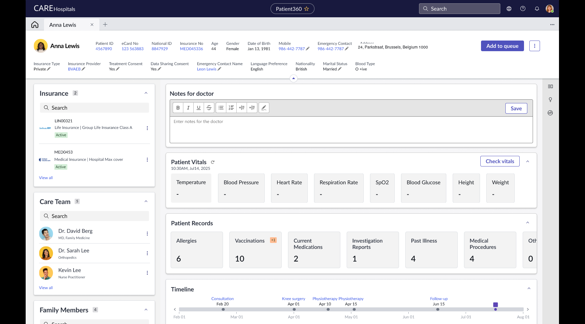
- **04 — Patient Activity feed** (right-rail timeline w/ GDPR event).
  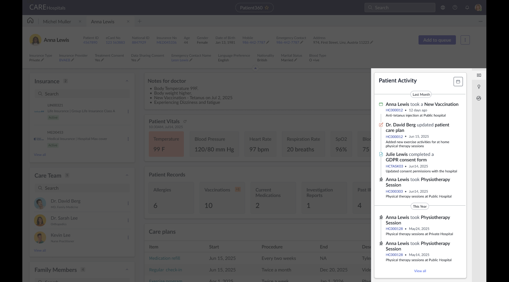
- **06 — Doctor view, Nurse Notes populated** (handoff detail; near-dupe of #05).
  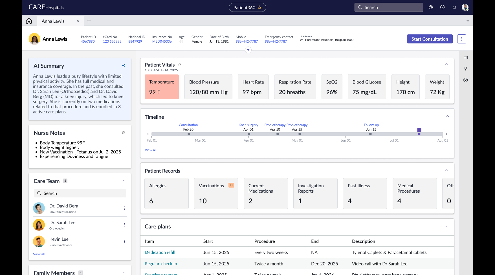
- **07 — Family Members modal** (relationships).
  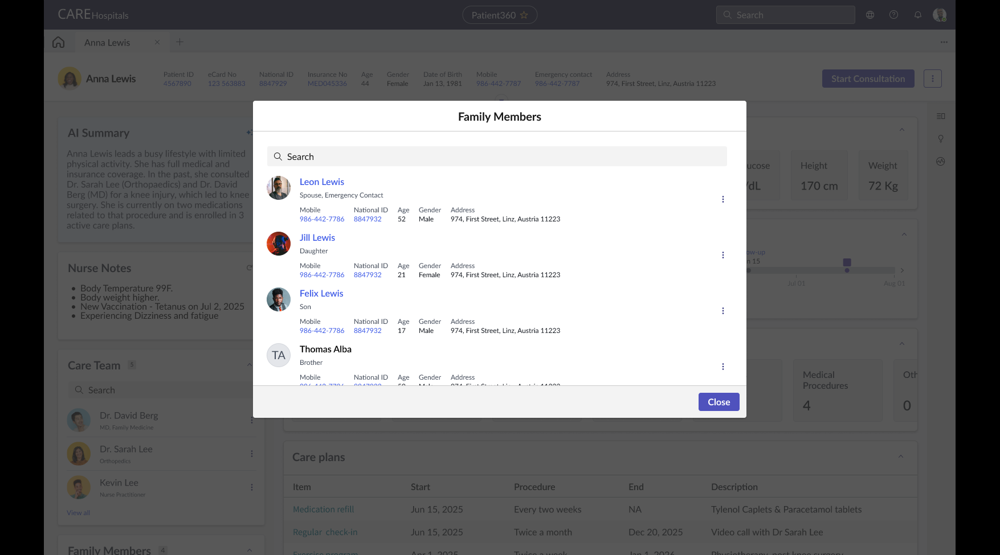
- **13 — Household Members full page.**
  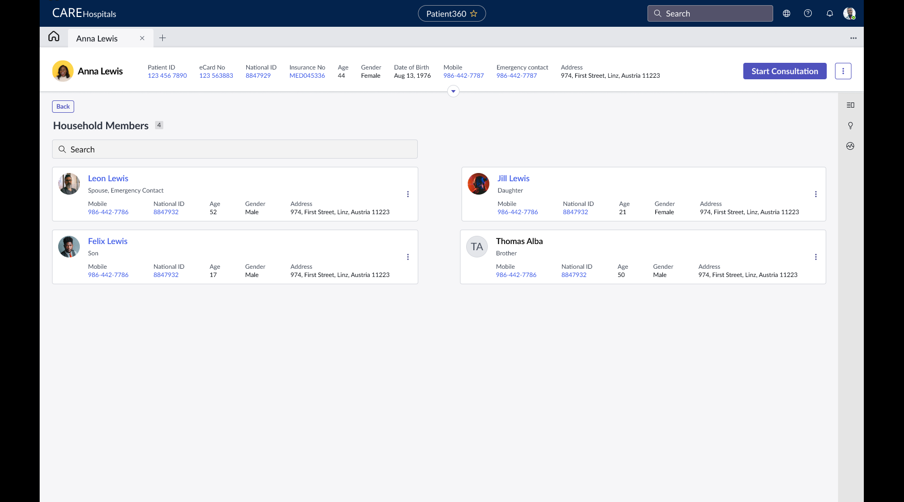
- **14 — Investigation Reports list.**
  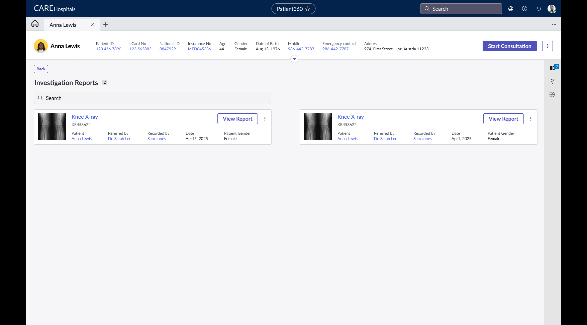
- **15 — Rx as a structured table** (alt of #11).
  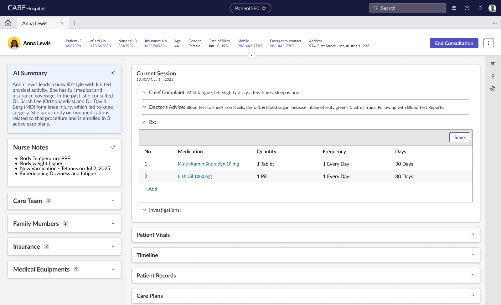

### My recommendation — which few to add
Feature **four hero screens** that carry the whole argument, plus **2–3 supporting** ones:

- **Hero A (the payoff):** #03 **and** #05 shown side-by-side = *same patient, nurse view vs doctor
  view* → the clearest proof of "one system, two clinicians."
- **Hero B:** #09 consultation focus mode → the layout adapts to the *task*, not just the role.
- **Hero C:** #11 smart Rx → concrete "reduce data entry" payoff.
- **Supporting (pick 2–3):** #02 Check Vitals (nurse task), #08 Investigation Report (scannable
  clinical story), #12 loop-closes (why it's one system). #10 compliance only if we generalize the
  labels.

Everything else stays documented here for reference. This keeps the page tight and on-message
rather than a screen dump.

---

## Diagrams to re-create on the site (in ink + terracotta + paper)

Keep these — they're the backbone of the story:
- **Consultation Journey** swimlane (slide 10) — Nurse/Doctor × Pre/During/Post.
- **Needs Matrix** (slide 11) — User Need → Data Need → Functional Need.
- Optional: **Two-users-one-system** concept diagram (the role-adaptive layout — your core idea).
- Optional: **HMW** constellation (slide 12).

## Confidentiality notes

Self-initiated / fictional scenario → safe to show in full. **Do not name the real interviewing
company** anywhere on the public page.

## Decisions made (author)

1. ✅ **Present end-to-end.** Final design screens **received** (hi-fi prototype, Aug 2, 2026); the
   case study will include the designed solution, not just discovery. Home-tile "end-to-end"
   wording stays.
2. ✅ **"Two users, one system" is proven in the UI** — the nurse view (#03) vs doctor view (#05)
   of the same patient record. No need to invent a concept diagram; use the real screens
   side-by-side.
3. ✅ **Healthcare-system slide:** keep the insight, **generalize** the Austria/EU specifics.

## Build decisions (finalized — page shipped)

- ✅ **Page built:** `work/patient360.html`, structured like the other case studies
  (hero → cover → three lenses → context → constraint → Rigor → Vision → Craft → trade-off →
  outcome → closing).
- ✅ **Title:** "Patient 360: one system, two clinicians." · **Year:** 2023.
- ✅ **Featured screens:** heroes #03 + #05 side-by-side (Vision); #09, #11, #02, #08, #12 (Craft).
- ✅ **Neutral address:** the visible Austrian address ("974, First Street, Linz, Austria 11223")
  was replaced with a neutral European one — **"24, Parkstraat, Brussels, Belgium 1000"** — on all
  featured header screens (#01, #03, #05, #06, #09, #11, #12) via a pixel overlay. Originals still
  in `/final/` history; the ELGA compliance panel (#10) is **not** featured.
- ✅ **Desktop-first, no mobile:** confirmed no mobile/companion experience; desktop framed as the
  primary surface.
- ✅ **New diagrams** (site visual language): `assets/images/p360-cover.svg`,
  `p360-journey.svg` (consultation swimlane), `p360-needs.svg` (needs matrix).
